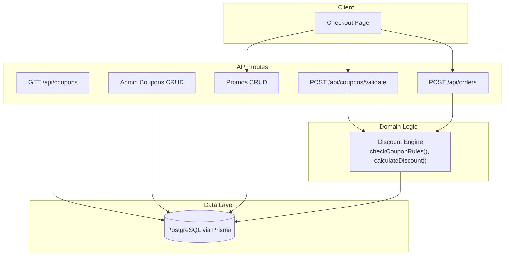
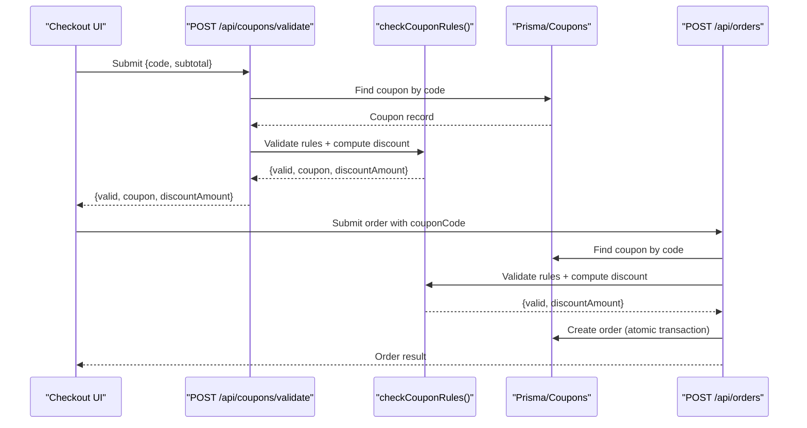
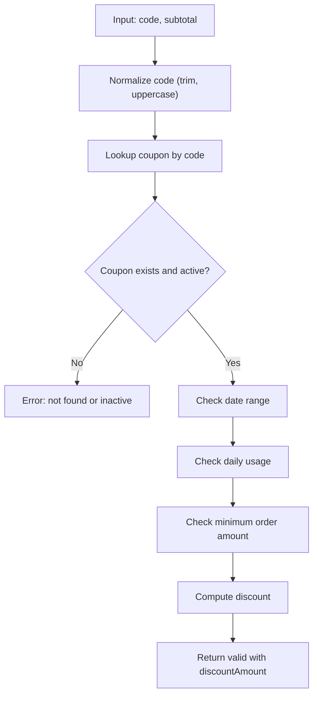
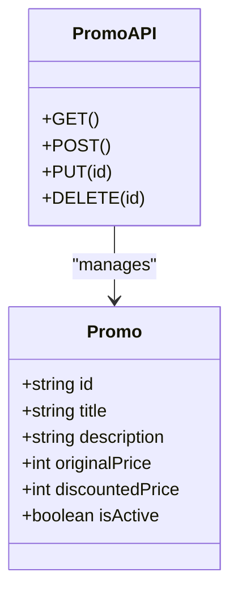
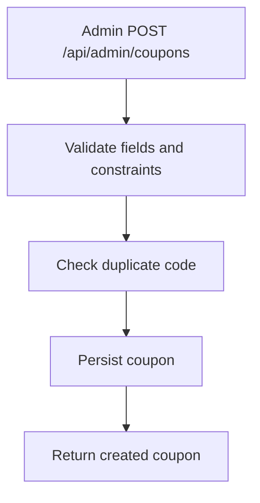
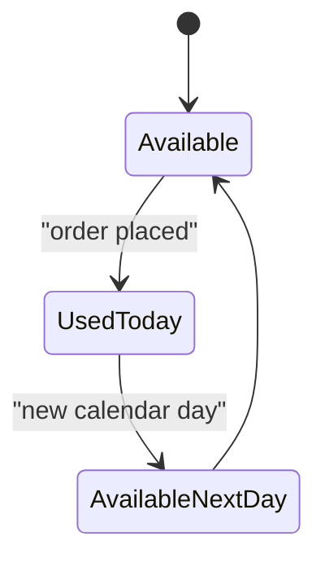
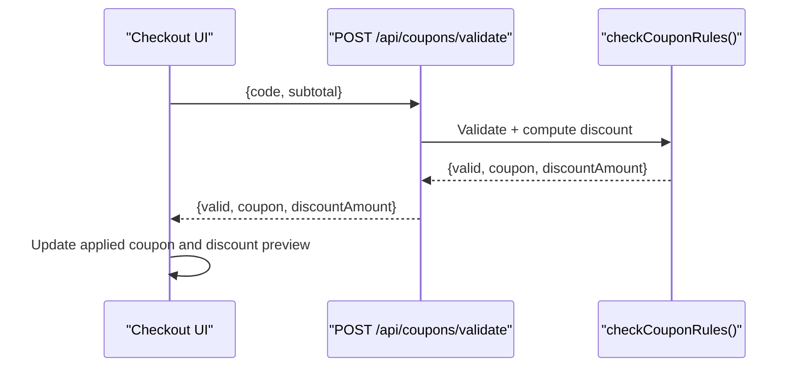
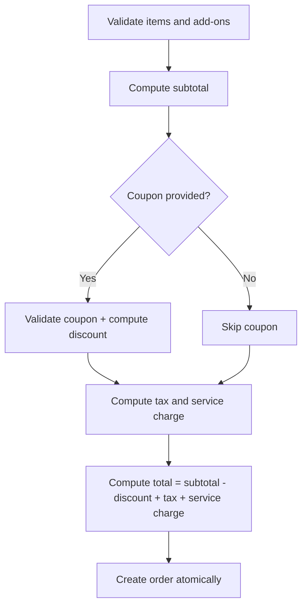
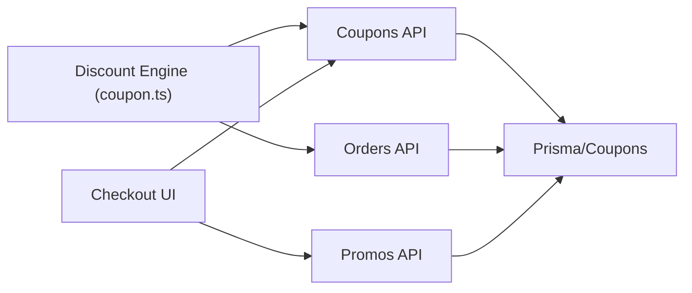

# Promotions & Coupons

<cite>
**Referenced Files in This Document**
- [schema.prisma](file://prisma/schema.prisma)
- [coupon.ts](file://lib/coupon.ts)
- [route.ts (coupons list)](file://app/api/coupons/route.ts)
- [route.ts (coupon validation)](file://app/api/coupons/validate/route.ts)
- [route.ts (admin coupons list and create)](file://app/api/admin/coupons/route.ts)
- [route.ts (admin coupon update/delete)](file://app/api/admin/coupons/[id]/route.ts)
- [route.ts (promos list/create)](file://app/api/promos/route.ts)
- [route.ts (promo update/delete)](file://app/api/promos/[id]/route.ts)
- [page.tsx (checkout)](file://app/checkout/page.tsx)
- [route.ts (orders)](file://app/api/orders/route.ts)
</cite>

## Table of Contents
1. [Introduction](#introduction)
2. [Project Structure](#project-structure)
3. [Core Components](#core-components)
4. [Architecture Overview](#architecture-overview)
5. [Detailed Component Analysis](#detailed-component-analysis)
6. [Dependency Analysis](#dependency-analysis)
7. [Performance Considerations](#performance-considerations)
8. [Security and Fraud Prevention](#security-and-fraud-prevention)
9. [Troubleshooting Guide](#troubleshooting-guide)
10. [Conclusion](#conclusion)

## Introduction
This document explains the promotions and coupon management system, including discount calculation, coupon validation rules, promotional pricing display, cart discount application, order total computation, usage tracking, expiration handling, security measures, and performance optimization strategies.

The system supports:
- Promotional menu items with original and discounted prices.
- Coupon codes that apply percentage or fixed discounts with minimum order thresholds and optional maximum discount caps.
- Server-side authoritative calculations for tax, service charge, and final totals.
- Admin APIs to manage coupons and promos.
- Usage tracking via per-day availability and atomic order creation.

## Project Structure
Promotions and coupons are implemented across API routes, a shared discount engine, and data models:

- Data model definitions live in the Prisma schema.
- The discount engine is centralized in a reusable library module.
- Public and admin API routes expose CRUD and validation endpoints.
- Checkout UI integrates coupon validation and promo item selection.
- Order creation recomputes totals server-side and records coupon usage atomically.

**Diagram sources**
- [route.ts (coupons list):1-33](file://app/api/coupons/route.ts#L1-L33)
- [route.ts (coupon validation):1-57](file://app/api/coupons/validate/route.ts#L1-L57)
- [route.ts (admin coupons list and create):1-129](file://app/api/admin/coupons/route.ts#L1-L129)
- [route.ts (admin coupon update/delete):1-102](file://app/api/admin/coupons/[id]/route.ts#L1-L102)
- [route.ts (promos list/create):1-38](file://app/api/promos/route.ts#L1-L38)
- [route.ts (promo update/delete):1-52](file://app/api/promos/[id]/route.ts#L1-L52)
- [route.ts (orders):160-199](file://app/api/orders/route.ts#L160-L199)
- [coupon.ts:1-133](file://lib/coupon.ts#L1-L133)

**Section sources**
- [schema.prisma:47-97](file://prisma/schema.prisma#L47-L97)
- [coupon.ts:1-133](file://lib/coupon.ts#L1-L133)
- [route.ts (coupons list):1-33](file://app/api/coupons/route.ts#L1-L33)
- [route.ts (coupon validation):1-57](file://app/api/coupons/validate/route.ts#L1-L57)
- [route.ts (admin coupons list and create):1-129](file://app/api/admin/coupons/route.ts#L1-L129)
- [route.ts (admin coupon update/delete):1-102](file://app/api/admin/coupons/[id]/route.ts#L1-L102)
- [route.ts (promos list/create):1-38](file://app/api/promos/route.ts#L1-L38)
- [route.ts (promo update/delete):1-52](file://app/api/promos/[id]/route.ts#L1-L52)
- [page.tsx (checkout):93-173](file://app/checkout/page.tsx#L93-L173)
- [route.ts (orders):160-199](file://app/api/orders/route.ts#L160-L199)

## Core Components
- Discount engine: Centralized logic for coupon validation and discount calculation.
- Coupon data model: Stores code, discount type/value, min order amount, max discount cap, validity period, active state, and usage metadata.
- Promo data model: Stores promotional menu items with original and discounted prices.
- API layer: Endpoints for listing, validating, creating, updating, and deleting coupons and promos; order creation applies coupons and computes totals.
- Checkout UI: Applies coupons, shows promo items, and previews totals before submission.

Key responsibilities:
- Validation: Enforce active status, date range, daily usage limit, and minimum order amount.
- Calculation: Compute discount based on percentage or fixed value, capped by maximum discount and subtotal.
- Persistence: Store orders with coupon code and discount amount; track last used date for daily limits.

**Section sources**
- [coupon.ts:3-17](file://lib/coupon.ts#L3-L17)
- [schema.prisma:47-97](file://prisma/schema.prisma#L47-L97)
- [route.ts (coupon validation):1-57](file://app/api/coupons/validate/route.ts#L1-L57)
- [route.ts (orders):160-199](file://app/api/orders/route.ts#L160-L199)

## Architecture Overview
The system follows a layered architecture:
- Client layer: Checkout page interacts with public coupon validation and promo endpoints.
- API layer: Next.js route handlers validate inputs, call domain logic, and persist data.
- Domain layer: Reusable functions encapsulate business rules for coupon validation and discount calculation.
- Data layer: Prisma client queries PostgreSQL tables for coupons, promos, and orders.

**Diagram sources**
- [route.ts (coupon validation):1-57](file://app/api/coupons/validate/route.ts#L1-L57)
- [coupon.ts:80-132](file://lib/coupon.ts#L80-L132)
- [route.ts (orders):160-199](file://app/api/orders/route.ts#L160-L199)

## Detailed Component Analysis

### Discount Calculation Engine
Responsibilities:
- Determine if a coupon is available today using lastUsedDate.
- Calculate discount amount based on discountType (PERCENTAGE or FIXED), discountValue, optional maxDiscountAmount, and subtotal.
- Provide a unified validation function that checks active status, date range, daily usage, and minimum order amount.

Complexity:
- Time complexity: O(1) per validation and discount calculation.
- Space complexity: O(1).

Optimization opportunities:
- Cache frequently validated coupons in memory for short-lived sessions.
- Precompute discount ranges for common subtotal buckets if needed.

Error handling:
- Returns structured results indicating validity and error messages.
- Ensures discount never exceeds subtotal and is non-negative.

**Diagram sources**
- [coupon.ts:23-61](file://lib/coupon.ts#L23-L61)
- [coupon.ts:80-132](file://lib/coupon.ts#L80-L132)

**Section sources**
- [coupon.ts:1-133](file://lib/coupon.ts#L1-L133)

### Coupon Validation Rules
Rules enforced:
- Coupon must exist and be active.
- Current time must be within the start and end dates.
- Coupon can be used only once per calendar day (based on lastUsedDate).
- Subtotal must meet the minimum order amount.
- Discount calculation respects percentage/fixed types and optional maximum discount cap.

Validation flow:
- Input normalization: Trim and uppercase coupon code.
- Database lookup: Retrieve coupon by unique code.
- Rule evaluation: Apply all business rules.
- Result: Return structured response with coupon details and computed discount when valid.

**Diagram sources**
- [route.ts (coupon validation):1-57](file://app/api/coupons/validate/route.ts#L1-L57)
- [coupon.ts:80-132](file://lib/coupon.ts#L80-L132)

**Section sources**
- [route.ts (coupon validation):1-57](file://app/api/coupons/validate/route.ts#L1-L57)
- [coupon.ts:80-132](file://lib/coupon.ts#L80-L132)

### Promotional Pricing Logic
Promo items are stored with original and discounted prices and displayed as menu items. The checkout page converts a selected promo into a cart item using its discounted price.

Display behavior:
- List active promos via GET /api/promos.
- Optionally include inactive promos for admin purposes.
- Add promo as a cart item with name, description, and discounted price.

Creation and updates:
- Admin endpoints support creating, updating, and deleting promos.
- Fields include title, description, originalPrice, discountedPrice, and isActive.

**Diagram sources**
- [schema.prisma:47-56](file://prisma/schema.prisma#L47-L56)
- [route.ts (promos list/create):1-38](file://app/api/promos/route.ts#L1-L38)
- [route.ts (promo update/delete):1-52](file://app/api/promos/[id]/route.ts#L1-L52)

**Section sources**
- [schema.prisma:47-56](file://prisma/schema.prisma#L47-L56)
- [route.ts (promos list/create):1-38](file://app/api/promos/route.ts#L1-L38)
- [route.ts (promo update/delete):1-52](file://app/api/promos/[id]/route.ts#L1-L52)
- [page.tsx (checkout):93-106](file://app/checkout/page.tsx#L93-L106)

### Coupon Creation Workflow
Admin workflow:
- Validate required fields: code, title, discountType, discountValue, minOrderAmount, startDate, endDate.
- Enforce business constraints: positive discount values, percentage <= 100%, valid date ranges, no duplicate codes.
- Persist coupon with default active state unless specified otherwise.

Enrichment:
- Admin list endpoint enriches coupons with isAvailableToday flag using the same daily availability logic.

**Diagram sources**
- [route.ts (admin coupons list and create):29-129](file://app/api/admin/coupons/route.ts#L29-L129)

**Section sources**
- [route.ts (admin coupons list and create):1-129](file://app/api/admin/coupons/route.ts#L1-L129)

### Usage Tracking and Expiration Handling
Usage tracking:
- Daily usage is tracked via lastUsedDate field.
- isCouponAvailableToday compares lastUsedDate with current date to determine availability.
- On successful order creation, the system updates usage metadata atomically within a transaction.

Expiration handling:
- Validation rejects coupons outside their startDate and endDate.
- Listing endpoints filter by active status and date range.

**Diagram sources**
- [coupon.ts:23-33](file://lib/coupon.ts#L23-L33)
- [route.ts (orders):195-199](file://app/api/orders/route.ts#L195-L199)

**Section sources**
- [coupon.ts:23-33](file://lib/coupon.ts#L23-L33)
- [route.ts (orders):195-199](file://app/api/orders/route.ts#L195-L199)

### Menu Item Promotion Display
Promo items are presented as menu entries with discounted prices. The checkout page adds selected promos to the cart as regular items using the discounted price.

Behavior:
- Fetch active promos from API.
- Convert promo to a cart item with name, description, and discounted price.
- Show promo selection in checkout UI.

**Section sources**
- [route.ts (promos list/create):1-38](file://app/api/promos/route.ts#L1-L38)
- [page.tsx (checkout):93-106](file://app/checkout/page.tsx#L93-L106)

### Cart Discount Application
On the checkout page:
- User enters a coupon code.
- Frontend calls POST /api/coupons/validate with code and subtotal.
- If valid, frontend displays applied coupon and discount amount.
- Frontend recalculates preview discount when subtotal changes, ensuring consistency with server-side rules.

Important note:
- Final totals are recomputed server-side during order creation; frontend preview is for display only.

**Diagram sources**
- [page.tsx (checkout):108-173](file://app/checkout/page.tsx#L108-L173)
- [route.ts (coupon validation):1-57](file://app/api/coupons/validate/route.ts#L1-L57)
- [coupon.ts:80-132](file://lib/coupon.ts#L80-L132)

**Section sources**
- [page.tsx (checkout):108-173](file://app/checkout/page.tsx#L108-L173)
- [route.ts (coupon validation):1-57](file://app/api/coupons/validate/route.ts#L1-L57)

### Order Total Calculations
Server-side order creation:
- Validates items and add-ons.
- Computes subtotal from validated items.
- Optionally validates coupon and computes discount.
- Calculates tax and service charge based on configured rates.
- Computes final total: subtotal - discount + tax + service charge.
- Creates order atomically within a transaction, recording coupon usage.

**Diagram sources**
- [route.ts (orders):160-199](file://app/api/orders/route.ts#L160-L199)

**Section sources**
- [route.ts (orders):160-199](file://app/api/orders/route.ts#L160-L199)

## Dependency Analysis
Coupling and cohesion:
- The discount engine is decoupled from API routes, promoting reuse and testability.
- API routes depend on Prisma for data access and on the discount engine for business logic.
- Checkout UI depends on public coupon validation and promo endpoints.

External dependencies:
- PostgreSQL database accessed via Prisma.
- Next.js runtime for API routes.

Potential circular dependencies:
- None observed; domain logic is isolated in the library module.

**Diagram sources**
- [coupon.ts:1-133](file://lib/coupon.ts#L1-L133)
- [route.ts (coupons list):1-33](file://app/api/coupons/route.ts#L1-L33)
- [route.ts (coupon validation):1-57](file://app/api/coupons/validate/route.ts#L1-L57)
- [route.ts (orders):160-199](file://app/api/orders/route.ts#L160-L199)
- [route.ts (promos list/create):1-38](file://app/api/promos/route.ts#L1-L38)

**Section sources**
- [coupon.ts:1-133](file://lib/coupon.ts#L1-L133)
- [route.ts (coupons list):1-33](file://app/api/coupons/route.ts#L1-L33)
- [route.ts (coupon validation):1-57](file://app/api/coupons/validate/route.ts#L1-L57)
- [route.ts (orders):160-199](file://app/api/orders/route.ts#L160-L199)
- [route.ts (promos list/create):1-38](file://app/api/promos/route.ts#L1-L38)

## Performance Considerations
- Indexing: Ensure indexes on coupon.code and coupon.isActive to speed up lookups and filtering.
- Query optimization: Use server-side filters for active and date-range-valid coupons to reduce payload size.
- Caching: Consider short-term in-memory caching for frequently accessed coupons and promos to reduce database load.
- Transaction efficiency: Keep order creation transactions minimal and focused on essential writes.
- Frontend preview: Avoid redundant recalculations by debouncing subtotal changes in the checkout UI.

[No sources needed since this section provides general guidance]

## Security and Fraud Prevention
Measures implemented:
- Server-side authoritative validation: All coupon validations and discount computations occur on the server.
- Strict input validation: Admin endpoints enforce field constraints, positive values, percentage limits, and valid date ranges.
- Unique code enforcement: Duplicate coupon codes are rejected at creation and update.
- Soft delete for coupons: Deactivation sets isActive to false rather than deleting records, preserving audit trails.
- Atomic operations: Order creation and coupon usage updates occur within a transaction to prevent race conditions.

Recommended enhancements:
- Rate limiting on coupon validation endpoints to mitigate abuse.
- Request signing or CSRF protection for sensitive admin operations.
- Audit logging for coupon usage and modifications.
- IP-based throttling and anomaly detection for repeated failed validations.

**Section sources**
- [route.ts (admin coupons list and create):29-129](file://app/api/admin/coupons/route.ts#L29-L129)
- [route.ts (admin coupon update/delete):1-102](file://app/api/admin/coupons/[id]/route.ts#L1-L102)
- [route.ts (orders):195-199](file://app/api/orders/route.ts#L195-L199)

## Troubleshooting Guide
Common issues and resolutions:
- Coupon not found or inactive: Verify isActive and existence in the database; ensure correct code casing.
- Coupon expired or not started: Check startDate and endDate against current time.
- Daily usage limit reached: Confirm lastUsedDate is not on the current calendar day.
- Minimum order amount not met: Increase subtotal or adjust coupon minOrderAmount.
- Invalid discount configuration: Ensure discountValue is positive and percentage <= 100%; verify maxDiscountAmount logic.
- Order creation errors: Inspect server logs for transaction failures and ensure coupon validation passes before submission.

Operational tips:
- Use admin endpoints to list coupons with isAvailableToday flags for quick diagnostics.
- Validate coupon responses from POST /api/coupons/validate before applying them in the UI.
- Monitor order creation logs to confirm atomic updates and correct total calculations.

**Section sources**
- [route.ts (coupon validation):1-57](file://app/api/coupons/validate/route.ts#L1-L57)
- [route.ts (admin coupons list and create):1-129](file://app/api/admin/coupons/route.ts#L1-L129)
- [route.ts (orders):160-199](file://app/api/orders/route.ts#L160-L199)

## Conclusion
The promotions and coupons system provides a robust foundation for managing promotional pricing and coupon-based discounts. It enforces strict validation rules, calculates discounts accurately, and ensures order totals are computed authoritatively on the server. Admin APIs facilitate safe management of coupons and promos, while usage tracking and atomic transactions maintain data integrity. With additional security and performance enhancements, the system can scale effectively to handle high-volume promotions and coupon usage.

[No sources needed since this section summarizes without analyzing specific files]