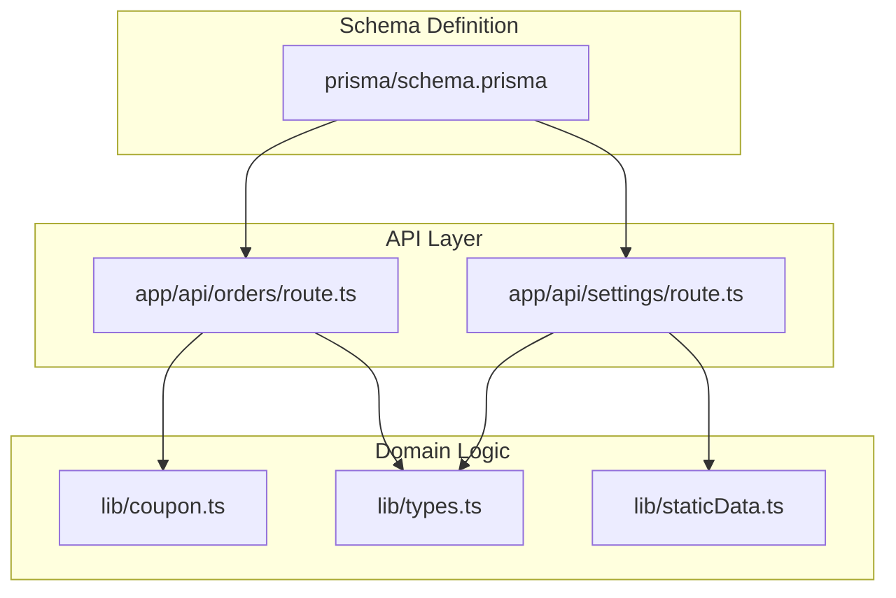
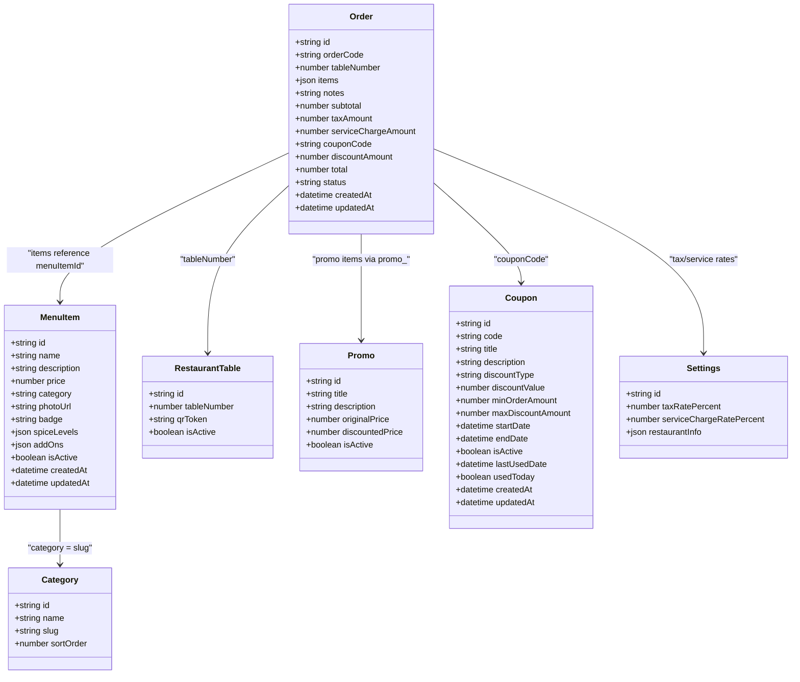
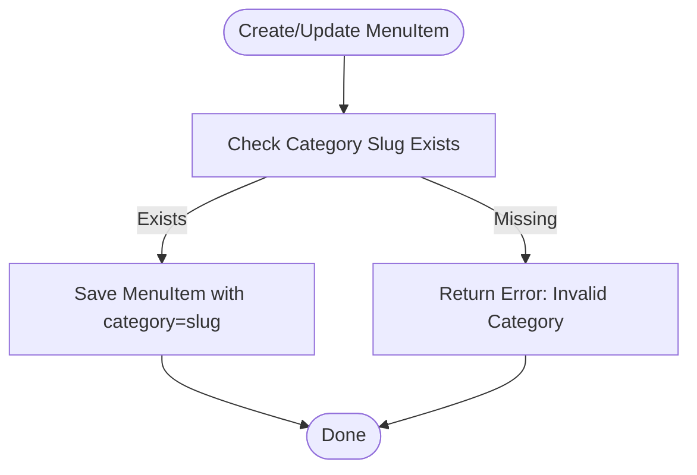
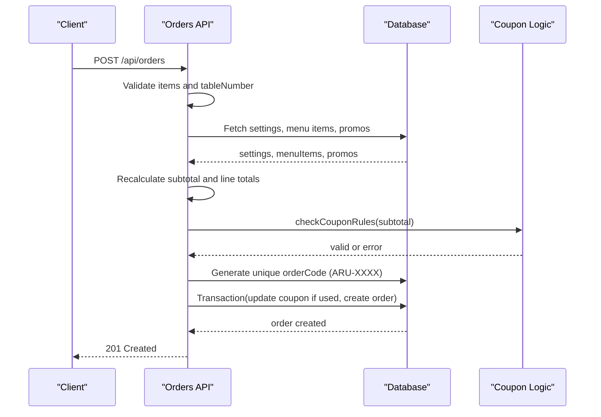
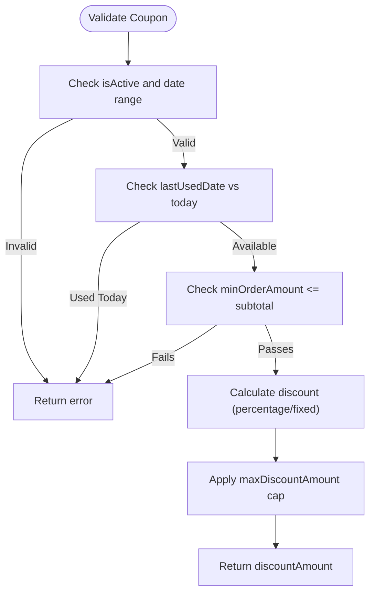
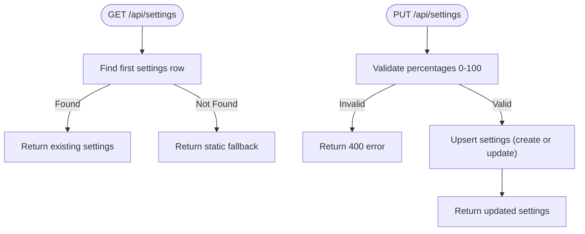
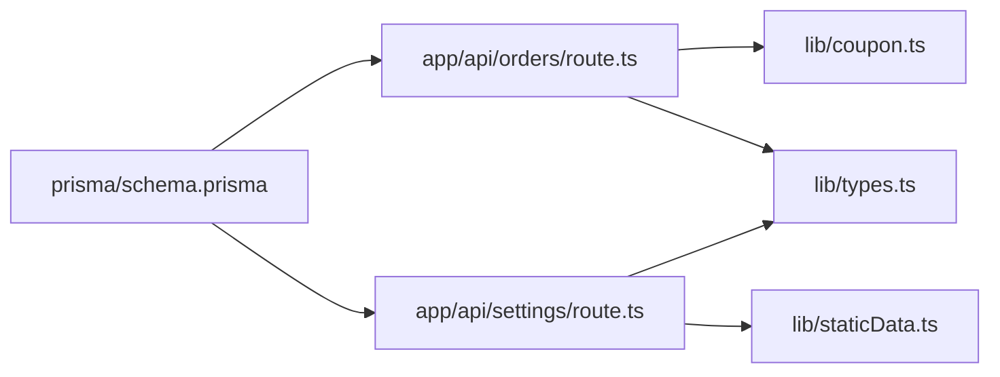
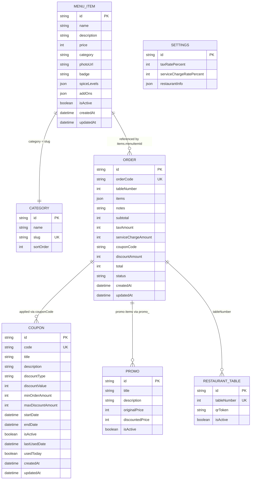

# Data Models & Schema Design

<cite>
**Referenced Files in This Document**
- [schema.prisma](file://prisma/schema.prisma)
- [route.ts (orders)](file://app/api/orders/route.ts)
- [route.ts (settings)](file://app/api/settings/route.ts)
- [coupon.ts](file://lib/coupon.ts)
- [types.ts](file://lib/types.ts)
- [staticData.ts](file://lib/staticData.ts)
- [README.md](file://README.md)
</cite>

## Table of Contents
1. [Introduction](#introduction)
2. [Project Structure](#project-structure)
3. [Core Components](#core-components)
4. [Architecture Overview](#architecture-overview)
5. [Detailed Component Analysis](#detailed-component-analysis)
6. [Dependency Analysis](#dependency-analysis)
7. [Performance Considerations](#performance-considerations)
8. [Troubleshooting Guide](#troubleshooting-guide)
9. [Conclusion](#conclusion)
10. [Appendices](#appendices)

## Introduction
This document describes the Warkop Betawa database schema and data model. It focuses on the core entities: `MenuItem`, `Category`, `Order`, `Coupon`, `Settings`, and `Table`. It explains field definitions, data types, constraints, business rules, and design decisions such as string-based category slugs, human-readable order codes, and singleton settings. It also includes entity relationship diagrams, sample data structures, and migration guidance for evolving the schema safely.

## Project Structure
The database schema is defined with Prisma under `prisma/schema.prisma`. The application uses Next.js API routes to read and write data through Prisma Client. Shared TypeScript interfaces in `lib/types.ts` describe runtime shapes that align closely with the persisted models.

**Diagram sources**
- [schema.prisma:1-107](file://prisma/schema.prisma#L1-L107)
- [route.ts (orders):1-245](file://app/api/orders/route.ts#L1-L245)
- [route.ts (settings):1-67](file://app/api/settings/route.ts#L1-L67)
- [coupon.ts:1-133](file://lib/coupon.ts#L1-L133)
- [types.ts:1-119](file://lib/types.ts#L1-L119)
- [staticData.ts:144-165](file://lib/staticData.ts#L144-L165)

**Section sources**
- [schema.prisma:1-107](file://prisma/schema.prisma#L1-L107)
- [README.md:66-105](file://README.md#L66-L105)

## Core Components
The following tables summarize each model’s fields, types, constraints, and key business rules.

### Category
- Purpose: Defines menu categories with a stable slug used by `MenuItem.category`.
- Fields:
  - id: String, primary key, auto-generated cuid
  - name: String
  - slug: String, unique
  - sortOrder: Integer, default 0
- Constraints:
  - slug must be unique across all categories
- Business rules:
  - UI filters menu items by comparing `MenuItem.category` against category slugs
  - Admin panel manages slugs; menu items store slugs directly rather than foreign keys

### MenuItem
- Purpose: Represents a sellable menu item with pricing, categorization, and optional metadata.
- Fields:
  - id: String, primary key, auto-generated cuid
  - name: String
  - description: String
  - price: Integer (cents or smallest currency unit)
  - category: String (slug reference to `Category.slug`)
  - photoUrl: String
  - badge: String, default "none"
  - spiceLevels: JSON array, default empty array
  - addOns: JSON array, default empty array
  - isActive: Boolean, default true
  - createdAt: DateTime, default now
  - updatedAt: DateTime, updated automatically
- Indexes:
  - Composite index on (isActive, category) for efficient filtering
- Business rules:
  - Only active items are considered during order creation
  - Add-ons and spice levels are validated server-side against stored values

### RestaurantTable
- Purpose: Represents physical tables with QR tokens for table-based ordering.
- Fields:
  - id: String, primary key, auto-generated cuid
  - tableNumber: Integer, unique
  - qrToken: String
  - isActive: Boolean, default true
- Business rules:
  - Orders validate tableNumber as a positive integer
  - Table existence is not strictly enforced at insert time; validation ensures logical consistency

### Promo
- Purpose: Promotional bundles or discounted items.
- Fields:
  - id: String, primary key, auto-generated cuid
  - title: String
  - description: String
  - originalPrice: Integer
  - discountedPrice: Integer
  - isActive: Boolean, default true
- Business rules:
  - Promo items are treated specially during order creation and use discounted prices

### Order
- Purpose: Captures customer orders with line items, taxes, service charges, discounts, and status.
- Fields:
  - id: String, primary key, auto-generated cuid
  - orderCode: String, unique, human-readable format ARU-XXXX
  - tableNumber: Integer
  - items: JSON array of order line items
  - notes: String, default empty
  - subtotal: Integer
  - taxAmount: Integer
  - serviceChargeAmount: Integer
  - couponCode: String?, nullable
  - discountAmount: Integer, default 0
  - total: Integer
  - status: String, default "received"
  - createdAt: DateTime, default now
  - updatedAt: DateTime, updated automatically
- Indexes:
  - Composite index on (status, createdAt) for admin listing and sorting
- Business rules:
  - Monetary values are recalculated server-side from DB prices
  - Coupon validation and usage updates occur atomically within a transaction
  - Status transitions are managed by admin operations

### Coupon
- Purpose: Defines promotional coupons with percentage or fixed discounts and scheduling.
- Fields:
  - id: String, primary key, auto-generated cuid
  - code: String, unique
  - title: String
  - description: String
  - discountType: String ("PERCENTAGE" or "FIXED")
  - discountValue: Integer
  - minOrderAmount: Integer, default 0
  - maxDiscountAmount: Integer?, nullable
  - startDate: DateTime
  - endDate: DateTime
  - isActive: Boolean, default true
  - lastUsedDate: DateTime?, nullable
  - usedToday: Boolean, default false
  - createdAt: DateTime, default now
  - updatedAt: DateTime, updated automatically
- Indexes:
  - Composite index on (code, isActive) for fast lookup and filtering
- Business rules:
  - Coupons can only be used once per calendar day
  - Discount calculation respects type, value, and maximum cap
  - Minimum order amount must be satisfied before applying discount

### Settings
- Purpose: Singleton configuration for tax rate, service charge rate, and restaurant info.
- Fields:
  - id: String, primary key, auto-generated cuid
  - taxRatePercent: Integer, default 10
  - serviceChargeRatePercent: Integer, default 5
  - restaurantInfo: JSON object, default empty object
- Business rules:
  - Singleton pattern: GET returns first record or static fallback; PUT creates if missing or updates existing
  - Percentages are validated between 0 and 100

**Section sources**
- [schema.prisma:11-18](file://prisma/schema.prisma#L11-L18)
- [schema.prisma:20-36](file://prisma/schema.prisma#L20-L36)
- [schema.prisma:38-45](file://prisma/schema.prisma#L38-L45)
- [schema.prisma:47-56](file://prisma/schema.prisma#L47-L56)
- [schema.prisma:58-76](file://prisma/schema.prisma#L58-L76)
- [schema.prisma:78-97](file://prisma/schema.prisma#L78-L97)
- [schema.prisma:99-106](file://prisma/schema.prisma#L99-L106)
- [types.ts:6-12](file://lib/types.ts#L6-L12)
- [types.ts:24-38](file://lib/types.ts#L24-L38)
- [types.ts:40-45](file://lib/types.ts#L40-L45)
- [types.ts:47-55](file://lib/types.ts#L47-L55)
- [types.ts:57-83](file://lib/types.ts#L57-L83)
- [types.ts:85-102](file://lib/types.ts#L85-L102)
- [types.ts:104-117](file://lib/types.ts#L104-L117)

## Architecture Overview
The system separates concerns into schema definition, API routes, domain logic, and shared types.

**Diagram sources**
- [schema.prisma:11-106](file://prisma/schema.prisma#L11-L106)
- [types.ts:6-117](file://lib/types.ts#L6-L117)

## Detailed Component Analysis

### Category and MenuItem Relationship
- Design decision: `MenuItem.category` stores a string slug instead of a foreign key to `Category.id`.
- Rationale:
  - Existing UI filters compare `MenuItem.category` with category slugs
  - Avoids significant UI rewrite and keeps simple comparisons
- Validation:
  - Admin panel ensures slugs exist when creating/editing menu items
  - Category uniqueness constraint prevents duplicate slugs

**Diagram sources**
- [schema.prisma:11-18](file://prisma/schema.prisma#L11-L18)
- [schema.prisma:20-36](file://prisma/schema.prisma#L20-L36)
- [README.md:85-89](file://README.md#L85-L89)

**Section sources**
- [schema.prisma:11-18](file://prisma/schema.prisma#L11-L18)
- [schema.prisma:20-36](file://prisma/schema.prisma#L20-L36)
- [README.md:85-89](file://README.md#L85-L89)

### Order Creation Flow and Human-Readable Codes
- Order code generation:
  - Format: ARU-XXXX where XXXX is a random four-digit number
  - Collision handling: retries up to three times to ensure uniqueness
- Price recalculation:
  - Subtotal, tax, service charge, and total are computed server-side
  - Browser-supplied totals are ignored to prevent manipulation
- Coupon integration:
  - Coupon validation occurs before finalizing the order
  - Usage updates (lastUsedDate, usedToday) happen inside a transaction

**Diagram sources**
- [route.ts (orders):6-9](file://app/api/orders/route.ts#L6-L9)
- [route.ts (orders):28-236](file://app/api/orders/route.ts#L28-L236)
- [coupon.ts:77-132](file://lib/coupon.ts#L77-L132)

**Section sources**
- [route.ts (orders):6-9](file://app/api/orders/route.ts#L6-L9)
- [route.ts (orders):28-236](file://app/api/orders/route.ts#L28-L236)
- [README.md:93-95](file://README.md#L93-L95)

### Coupon Validation and Discount Calculation
- Rules:
  - Must be active and within start/end dates
  - Cannot be used more than once per calendar day
  - Subtotal must meet minimum order amount
  - Discount capped by maxDiscountAmount for percentage type
- Output:
  - Returns either a validation result with discount amount or an error message

**Diagram sources**
- [coupon.ts:77-132](file://lib/coupon.ts#L77-L132)

**Section sources**
- [coupon.ts:1-133](file://lib/coupon.ts#L1-L133)

### Settings Singleton Pattern
- Behavior:
  - GET returns the first settings record; if none exists, returns static fallback
  - PUT creates a new settings record if missing or updates the existing one
  - Percentages are validated between 0 and 100
- Use cases:
  - Cart and checkout pages fetch tax/service rates on mount
  - Admin panel updates restaurant info and rates without redeployments

**Diagram sources**
- [route.ts (settings):7-67](file://app/api/settings/route.ts#L7-L67)
- [staticData.ts:155-165](file://lib/staticData.ts#L155-L165)

**Section sources**
- [route.ts (settings):1-67](file://app/api/settings/route.ts#L1-L67)
- [staticData.ts:155-165](file://lib/staticData.ts#L155-L165)

## Dependency Analysis
The following diagram shows how components depend on each other and the database schema.

**Diagram sources**
- [route.ts (orders):1-245](file://app/api/orders/route.ts#L1-L245)
- [coupon.ts:1-133](file://lib/coupon.ts#L1-L133)
- [types.ts:1-119](file://lib/types.ts#L1-L119)
- [route.ts (settings):1-67](file://app/api/settings/route.ts#L1-L67)
- [staticData.ts:144-165](file://lib/staticData.ts#L144-L165)
- [schema.prisma:1-107](file://prisma/schema.prisma#L1-L107)

**Section sources**
- [route.ts (orders):1-245](file://app/api/orders/route.ts#L1-L245)
- [route.ts (settings):1-67](file://app/api/settings/route.ts#L1-L67)
- [coupon.ts:1-133](file://lib/coupon.ts#L1-L133)
- [types.ts:1-119](file://lib/types.ts#L1-L119)
- [staticData.ts:144-165](file://lib/staticData.ts#L144-L165)
- [schema.prisma:1-107](file://prisma/schema.prisma#L1-L107)

## Performance Considerations
- Indexing:
  - `MenuItem`: composite index on (isActive, category) improves filtered queries
  - `Order`: composite index on (status, createdAt) optimizes admin listing and sorting
  - `Coupon`: composite index on (code, isActive) speeds up validation lookups
- Query batching:
  - Order creation batches fetching settings, menu items, and promos using parallel queries
- In-memory maps:
  - Uses Maps for quick lookup of menu items and promos during order processing
- JSON fields:
  - `spiceLevels`, `addOns`, `items`, and `restaurantInfo` are stored as JSON; consider adding generated columns or partial indexes if frequent filtering on nested fields is required

[No sources needed since this section provides general guidance]

## Troubleshooting Guide
Common issues and resolutions:
- Empty order payload:
  - Ensure `items` is a non-empty array; otherwise, the API returns a 400 error
- Invalid table number:
  - Provide a positive integer for `tableNumber`; invalid values return a 400 error
- Menu item not available:
  - If referenced `menuItemId` is inactive or missing, the API rejects the order
- Coupon not applicable:
  - Check activation status, date range, daily usage limit, and minimum order amount
- Settings not found:
  - GET returns static fallback if no settings row exists; use PUT to persist changes

**Section sources**
- [route.ts (orders):33-48](file://app/api/orders/route.ts#L33-L48)
- [route.ts (orders):120-128](file://app/api/orders/route.ts#L120-L128)
- [route.ts (orders):167-180](file://app/api/orders/route.ts#L167-L180)
- [route.ts (settings):7-16](file://app/api/settings/route.ts#L7-L16)

## Conclusion
The Warkop Betawa schema balances simplicity and correctness:
- String-based category slugs keep UI filtering straightforward
- Human-readable order codes improve communication between customers and staff
- Singleton settings centralize tax and service charge configuration
- Server-side price recalculation and transactional coupon updates protect integrity
Careful indexing and batched queries support performance, while JSON fields provide flexibility for structured metadata.

[No sources needed since this section summarizes without analyzing specific files]

## Appendices

### Entity Relationship Diagram

**Diagram sources**
- [schema.prisma:11-106](file://prisma/schema.prisma#L11-L106)

### Sample Data Structures
- Category example:
  - id: cuid
  - name: "Makanan"
  - slug: "makanan"
  - sortOrder: 1
- MenuItem example:
  - id: cuid
  - name: "Nasi Goreng Spesial"
  - description: "Wok-fried rice with secret heritage spices..."
  - price: 45000
  - category: "makanan"
  - photoUrl: "https://..."
  - badge: "best_seller"
  - spiceLevels: [{"label": "Tidak Pedas", "priceModifier": 0}, {"label": "Sedang", "priceModifier": 0}, {"label": "Pedas", "priceModifier": 0}]
  - addOns: [{"label": "Ekstra Telur", "price": 5000}, {"label": "Ekstra Ayam", "price": 10000}]
  - isActive: true
- Order example:
  - id: cuid
  - orderCode: "ARU-4821"
  - tableNumber: 5
  - items: [{"menuItemId": "item-1", "name": "Nasi Goreng Spesial", "qty": 2, "price": 45000, "spiceLevel": "Sedang", "addOns": [{"label": "Ekstra Telur", "price": 5000}], "lineTotal": 100000}]
  - notes: "Less spicy please"
  - subtotal: 100000
  - taxAmount: 10000
  - serviceChargeAmount: 5000
  - couponCode: "SAVE10"
  - discountAmount: 10000
  - total: 105000
  - status: "received"
- Coupon example:
  - id: cuid
  - code: "SAVE10"
  - title: "10% Off"
  - description: "Get 10% off your next order"
  - discountType: "PERCENTAGE"
  - discountValue: 10
  - minOrderAmount: 50000
  - maxDiscountAmount: 15000
  - startDate: "2024-01-01T00:00:00Z"
  - endDate: "2024-12-31T23:59:59Z"
  - isActive: true
  - lastUsedDate: null
  - usedToday: false
- Settings example:
  - id: cuid
  - taxRatePercent: 10
  - serviceChargeRatePercent: 5
  - restaurantInfo: {"name": "Warkop Betawa", "address": "Jl. Nusantara No. 14, Jakarta", "whatsapp": "+6281234567890", "instagram": "@selerasambal", "email": "halo@selerasambal.id"}

**Section sources**
- [staticData.ts:17-141](file://lib/staticData.ts#L17-L141)
- [staticData.ts:155-165](file://lib/staticData.ts#L155-L165)
- [types.ts:24-38](file://lib/types.ts#L24-L38)
- [types.ts:57-83](file://lib/types.ts#L57-L83)
- [types.ts:85-102](file://lib/types.ts#L85-L102)
- [types.ts:104-117](file://lib/types.ts#L104-L117)

### Migration Strategies for Schema Evolution
- Adding new fields:
  - Prefer nullable fields with defaults to avoid breaking existing clients
  - Example: add `currency` to `MenuItem` as nullable string with default "IDR"
- Renaming fields:
  - Use Prisma migrations to rename columns safely
  - Update TypeScript interfaces and API routes accordingly
- Changing data types:
  - For numeric precision, consider migrating from integer cents to decimal if fractional units are needed
  - Backfill existing records with safe conversions
- Introducing foreign keys:
  - Replace `MenuItem.category` slug with a proper foreign key to `Category.id`
  - Steps:
    1. Add temporary column `categoryId` (nullable)
    2. Backfill using slug-to-id mapping
    3. Enforce NOT NULL
    4. Drop old `category` slug column
    5. Update UI and APIs to use ID references
- Soft deletes:
  - Add `deletedAt` timestamp to entities like `MenuItem` and `RestaurantTable`
  - Update queries to filter out soft-deleted rows
- Versioning:
  - Maintain migration history and test migrations against staging databases
  - Rollback strategy: keep reversible migrations where possible

[No sources needed since this section provides general guidance]