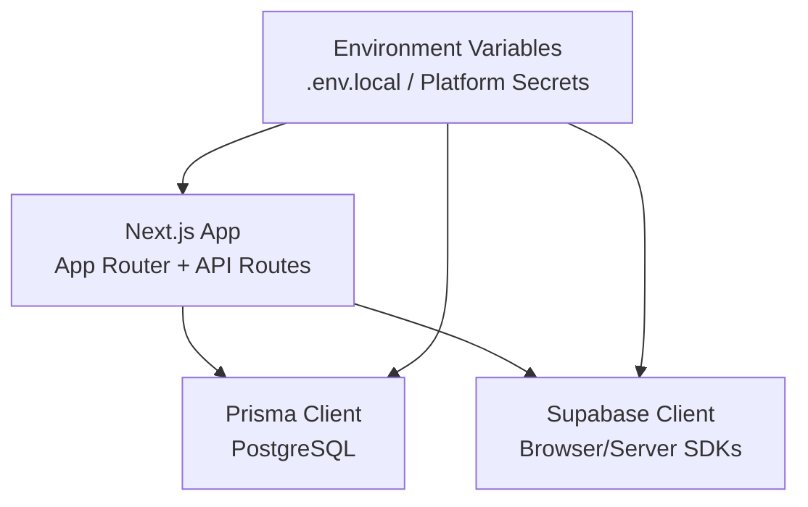
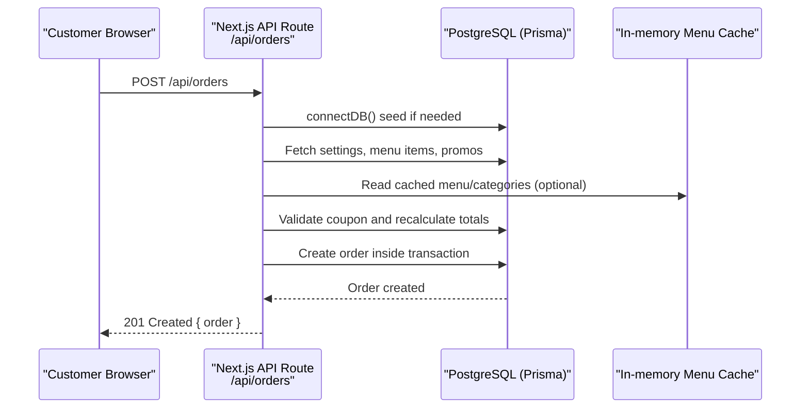
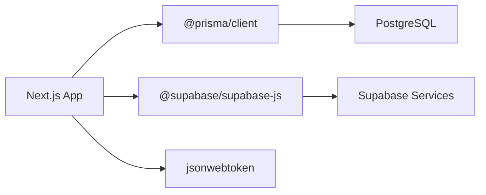

# Deployment Guide

<cite>
**Referenced Files in This Document**
- [README.md](file://README.md)
- [package.json](file://package.json)
- [next.config.js](file://next.config.js)
- [lib/db.ts](file://lib/db.ts)
- [lib/prisma.ts](file://lib/prisma.ts)
- [prisma/schema.prisma](file://prisma/schema.prisma)
- [app/api/orders/route.ts](file://app/api/orders/route.ts)
- [app/api/settings/route.ts](file://app/api/settings/route.ts)
- [lib/menuCache.ts](file://lib/menuCache.ts)
- [lib/supabase.ts](file://lib/supabase.ts)
- [lib/supabaseAdmin.ts](file://lib/supabaseAdmin.ts)
- [utils/supabase/middleware.ts](file://utils/supabase/middleware.ts)
- [utils/supabase/client.ts](file://utils/supabase/client.ts)
</cite>

## Table of Contents
1. Introduction
2. Project Structure
3. Core Components
4. Architecture Overview
5. Detailed Component Analysis
6. Dependency Analysis
7. Performance Considerations
8. Troubleshooting Guide
9. Conclusion
10. Appendices

## Introduction
This deployment guide covers how to deploy the Warkop Betawa restaurant ordering system to Vercel, Netlify, or a self-hosted environment. It documents production environment configuration, database setup and migrations, build processes, performance optimization, monitoring and logging, backup procedures, scaling considerations, CI/CD pipeline setup, automated testing, and deployment best practices.

The application is a Next.js 14 app with server-side API routes backed by Prisma and PostgreSQL (configured via DATABASE_URL). It also integrates Supabase for client/server SDK usage and optional storage/auth flows. The README describes MongoDB as part of the project narrative; however, the current codebase uses Prisma with PostgreSQL and includes Supabase integrations.

## Project Structure
High-level structure relevant to deployment:
- Next.js app with App Router API routes under app/api
- Database schema and Prisma client configuration under prisma and lib
- Supabase client utilities under lib and utils/supabase
- Build and runtime scripts defined in package.json
- Next.js runtime configuration in next.config.js

**Diagram sources**
- [package.json:6-12](file://package.json#L6-L12)
- [next.config.js:1-15](file://next.config.js#L1-L15)
- [prisma/schema.prisma:1-9](file://prisma/schema.prisma#L1-L9)
- [lib/prisma.ts:1-40](file://lib/prisma.ts#L1-L40)
- [lib/supabase.ts:1-22](file://lib/supabase.ts#L1-L22)
- [utils/supabase/middleware.ts:1-37](file://utils/supabase/middleware.ts#L1-L37)

**Section sources**
- [package.json:1-42](file://package.json#L1-L42)
- [next.config.js:1-15](file://next.config.js#L1-L15)
- [prisma/schema.prisma:1-107](file://prisma/schema.prisma#L1-L107)

## Core Components
- Next.js runtime and build scripts: dev, build, start, lint, postinstall
- Prisma client singleton with environment-aware logging
- Database seeding and connection helper
- Menu cache for high-frequency reads
- Supabase clients for browser and server contexts
- API routes for orders and settings

Key responsibilities:
- Build and run: package.json scripts
- Database connectivity and seeding: lib/db.ts, lib/prisma.ts
- Data model: prisma/schema.prisma
- Public read caching: lib/menuCache.ts
- Supabase integration: lib/supabase.ts, lib/supabaseAdmin.ts, utils/supabase/*

**Section sources**
- [package.json:6-12](file://package.json#L6-L12)
- [lib/prisma.ts:1-40](file://lib/prisma.ts#L1-L40)
- [lib/db.ts:1-161](file://lib/db.ts#L1-L161)
- [lib/menuCache.ts:1-47](file://lib/menuCache.ts#L1-L47)
- [lib/supabase.ts:1-22](file://lib/supabase.ts#L1-L22)
- [lib/supabaseAdmin.ts:1-22](file://lib/supabaseAdmin.ts#L1-L22)
- [utils/supabase/middleware.ts:1-37](file://utils/supabase/middleware.ts#L1-L37)
- [utils/supabase/client.ts:1-10](file://utils/supabase/client.ts#L1-L10)

## Architecture Overview
End-to-end request flow for order creation:

**Diagram sources**
- [app/api/orders/route.ts:1-245](file://app/api/orders/route.ts#L1-L245)
- [lib/db.ts:40-50](file://lib/db.ts#L40-L50)
- [lib/menuCache.ts:24-46](file://lib/menuCache.ts#L24-L46)
- [prisma/schema.prisma:58-76](file://prisma/schema.prisma#L58-L76)

## Detailed Component Analysis

### Environment Configuration
- Required variables:
  - DATABASE_URL: PostgreSQL connection string used by Prisma
  - NEXT_PUBLIC_SUPABASE_URL and NEXT_PUBLIC_SUPABASE_ANON_KEY: For client-side Supabase usage
  - SUPABASE_URL and SUPABASE_SECRET_KEY or SUPABASE_SERVICE_ROLE_KEY: For server-side admin operations
  - Optional: NEXT_PUBLIC_SUPABASE_PUBLISHABLE_KEY for middleware/browser client variants
- Where they are consumed:
  - Prisma datasource reads DATABASE_URL
  - Supabase browser client reads NEXT_PUBLIC_* keys
  - Supabase admin client reads server-only keys
  - Middleware and client helpers may use NEXT_PUBLIC_SUPABASE_PUBLISHABLE_KEY

Production recommendations:
- Store all secrets in your platform’s secret manager (Vercel/Netlify environment variables or your host’s secret store)
- Never commit .env files to version control
- Use separate DATABASE_URL values per environment (dev/staging/prod)

**Section sources**
- [prisma/schema.prisma:5-9](file://prisma/schema.prisma#L5-L9)
- [lib/supabase.ts:1-22](file://lib/supabase.ts#L1-L22)
- [lib/supabaseAdmin.ts:1-22](file://lib/supabaseAdmin.ts#L1-L22)
- [utils/supabase/middleware.ts:1-37](file://utils/supabase/middleware.ts#L1-L37)
- [utils/supabase/client.ts:1-10](file://utils/supabase/client.ts#L1-L10)

### Database Setup and Migrations
- Schema: PostgreSQL models for categories, menu items, tables, promos, orders, coupons, settings
- Seeding: On first connection, the app seeds categories, menu items, promos, settings, and tables 1–10
- Connection helper: connectDB ensures seeding runs once per process lifetime

Migration workflow:
- Develop locally with a local PostgreSQL instance or managed service
- Run migrations before deploying to production
- Ensure DATABASE_URL points to the correct database per environment

Backup strategy:
- Use your database provider’s native backup tools (e.g., pg_dump for PostgreSQL)
- Schedule periodic backups and retain multiple generations
- Test restore procedures regularly

**Section sources**
- [prisma/schema.prisma:11-107](file://prisma/schema.prisma#L11-L107)
- [lib/db.ts:32-50](file://lib/db.ts#L32-L50)
- [lib/db.ts:92-159](file://lib/db.ts#L92-L159)

### Build Process
- Scripts:
  - npm run dev: Start development server
  - npm run build: Build for production
  - npm run start: Start production server
  - npm run lint: Lint code
  - npm run postinstall: Sync Prisma skills on install
- Next.js config:
  - reactStrictMode enabled
  - images.remotePatterns allows loading remote images over HTTPS

Deployment notes:
- Vercel: Uses default Next.js builder; ensure DATABASE_URL and Supabase variables are set
- Netlify: Configure Node.js build command to run npm ci && npm run build; set environment variables in the dashboard
- Self-hosted: Build artifacts then run npm start with environment variables configured at runtime

**Section sources**
- [package.json:6-12](file://package.json#L6-L12)
- [next.config.js:1-15](file://next.config.js#L1-L15)

### API Endpoints and Business Logic
- Orders:
  - GET /api/orders: List orders newest first
  - POST /api/orders: Create order with server-side price recalculation, coupon validation, and atomic transaction
- Settings:
  - GET /api/settings: Retrieve settings (with static fallback)
  - PUT /api/settings: Update tax/service rates and restaurant info

Security and correctness:
- All monetary values are recalculated server-side from DB prices
- Add-ons validated against DB-defined options and prices
- Coupon rules enforced both pre-check and within transaction to prevent race conditions

**Section sources**
- [app/api/orders/route.ts:1-245](file://app/api/orders/route.ts#L1-L245)
- [app/api/settings/route.ts:1-68](file://app/api/settings/route.ts#L1-L68)

### Monitoring and Logging
- Prisma logging:
  - Development: query events emitted, errors/warnings logged to stdout
  - Production: only error logs enabled
- Application logs:
  - Console.error used in API routes for failures
- Recommendations:
  - Centralize logs using a structured logger (e.g., pino)
  - Forward logs to a log aggregation service (e.g., Vercel Logs, CloudWatch, Datadog)
  - Add healthcheck endpoints and metrics for uptime monitoring

**Section sources**
- [lib/prisma.ts:16-36](file://lib/prisma.ts#L16-L36)
- [app/api/orders/route.ts:17-20](file://app/api/orders/route.ts#L17-L20)
- [app/api/orders/route.ts:237-243](file://app/api/orders/route.ts#L237-L243)
- [app/api/settings/route.ts:13-16](file://app/api/settings/route.ts#L13-L16)
- [app/api/settings/route.ts:63-66](file://app/api/settings/route.ts#L63-L66)

### Performance Optimization
- In-memory menu cache:
  - TTL-based cache for menu and categories to reduce DB load
  - Invalidated on mutations
- Next.js image optimization:
  - Remote patterns allow HTTPS images
- Database indexing:
  - Indexes on frequently queried fields (isActive+category, status+createdAt, code+isActive)
- Query efficiency:
  - Batch fetches for settings, menu items, and promos in parallel
  - Server-side recalculation avoids unnecessary client logic

**Section sources**
- [lib/menuCache.ts:1-47](file://lib/menuCache.ts#L1-L47)
- [next.config.js:4-11](file://next.config.js#L4-L11)
- [prisma/schema.prisma:34-35](file://prisma/schema.prisma#L34-L35)
- [prisma/schema.prisma:74-75](file://prisma/schema.prisma#L74-L75)
- [prisma/schema.prisma:95-96](file://prisma/schema.prisma#L95-L96)
- [app/api/orders/route.ts:67-75](file://app/api/orders/route.ts#L67-L75)

### CI/CD Pipeline Setup
Recommended steps:
- Install dependencies: npm ci
- Lint: npm run lint
- Build: npm run build
- Deploy: push built artifacts to your platform
- Database migrations: run prisma migrate deploy in CI before starting the app
- Seed data: rely on connectDB seeding or run a dedicated seed script if needed

Automated testing:
- Unit tests for business logic (coupon validation, pricing calculations)
- Integration tests for API routes against a test database
- E2E tests for critical user journeys (menu browsing, cart, checkout)

**Section sources**
- [package.json:6-12](file://package.json#L6-L12)
- [lib/db.ts:40-50](file://lib/db.ts#L40-L50)

### Deployment Best Practices
- Environment isolation: Separate DATABASE_URL and Supabase credentials per environment
- Secret management: Use platform-native secret stores; avoid committing secrets
- Zero-downtime deployments: Prefer blue/green or canary releases where possible
- Health checks: Implement /health or similar endpoint for readiness probes
- Backups: Automate database backups and retention policies
- Rollback plan: Keep previous builds and database migration versions available

**Section sources**
- [lib/supabase.ts:1-22](file://lib/supabase.ts#L1-L22)
- [lib/supabaseAdmin.ts:1-22](file://lib/supabaseAdmin.ts#L1-L22)

## Dependency Analysis
Runtime dependencies relevant to deployment:
- Next.js application framework
- Prisma client for PostgreSQL
- Supabase JS SDKs for client and server contexts
- JSON Web Token library and other utilities

**Diagram sources**
- [package.json:13-29](file://package.json#L13-L29)
- [prisma/schema.prisma:5-9](file://prisma/schema.prisma#L5-L9)
- [lib/supabase.ts:1-22](file://lib/supabase.ts#L1-L22)

**Section sources**
- [package.json:13-29](file://package.json#L13-L29)
- [prisma/schema.prisma:5-9](file://prisma/schema.prisma#L5-L9)

## Performance Considerations
- Enable compression and HTTP/2 on your hosting platform
- Use CDN for static assets and images
- Tune Prisma connection pool settings based on workload
- Monitor slow queries and optimize indexes
- Consider caching strategies beyond in-memory cache (e.g., Redis) for multi-instance deployments

[No sources needed since this section provides general guidance]

## Troubleshooting Guide
Common issues and resolutions:
- Missing environment variables:
  - Verify DATABASE_URL and Supabase variables are set in your platform’s environment settings
- Database connection failures:
  - Check firewall rules, connection strings, and network access
- Migration errors:
  - Ensure migrations are applied before starting the app
- High latency on menu reads:
  - Confirm cache invalidation logic and consider external caching layer
- API errors:
  - Inspect console logs and Prisma error logs for stack traces

Operational tips:
- Add structured logging and error tracking (e.g., Sentry)
- Set up alerts for failed requests and database connection errors
- Regularly review logs for anomalies and performance regressions

**Section sources**
- [lib/prisma.ts:16-36](file://lib/prisma.ts#L16-L36)
- [app/api/orders/route.ts:17-20](file://app/api/orders/route.ts#L17-L20)
- [app/api/orders/route.ts:237-243](file://app/api/orders/route.ts#L237-L243)
- [app/api/settings/route.ts:13-16](file://app/api/settings/route.ts#L13-L16)
- [app/api/settings/route.ts:63-66](file://app/api/settings/route.ts#L63-L66)

## Conclusion
Deploying Warkop Betawa involves configuring environment variables for PostgreSQL and Supabase, running Prisma migrations, building the Next.js app, and ensuring robust monitoring and backup strategies. Follow the recommended CI/CD steps, automate testing, and apply performance optimizations to deliver a reliable, scalable restaurant ordering experience.

[No sources needed since this section summarizes without analyzing specific files]

## Appendices

### Environment Variables Reference
- DATABASE_URL: PostgreSQL connection string for Prisma
- NEXT_PUBLIC_SUPABASE_URL: Supabase project URL (client)
- NEXT_PUBLIC_SUPABASE_ANON_KEY: Supabase anon key (client)
- SUPABASE_URL: Supabase project URL (server)
- SUPABASE_SECRET_KEY or SUPABASE_SERVICE_ROLE_KEY: Supabase service role key (server)
- NEXT_PUBLIC_SUPABASE_PUBLISHABLE_KEY: Publishable key variant used in some helpers

**Section sources**
- [lib/supabase.ts:3-4](file://lib/supabase.ts#L3-L4)
- [lib/supabaseAdmin.ts:9-10](file://lib/supabaseAdmin.ts#L9-L10)
- [utils/supabase/middleware.ts:4-5](file://utils/supabase/middleware.ts#L4-L5)
- [utils/supabase/client.ts:3-4](file://utils/supabase/client.ts#L3-L4)

### Deployment Quickstart
- Vercel:
  - Connect repository
  - Set DATABASE_URL and Supabase variables
  - Deploy; Prisma will connect and seed on first run
- Netlify:
  - Set Node.js version and build command (npm ci && npm run build)
  - Set environment variables
  - Deploy; run migrations in a pre-deploy step if needed
- Self-hosted:
  - Build with npm run build
  - Run npm start with environment variables configured
  - Set up reverse proxy and TLS termination

**Section sources**
- [package.json:6-12](file://package.json#L6-L12)
- [lib/db.ts:40-50](file://lib/db.ts#L40-L50)