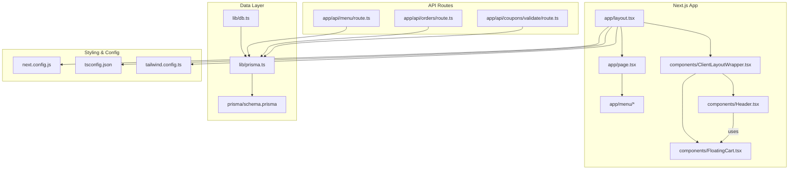
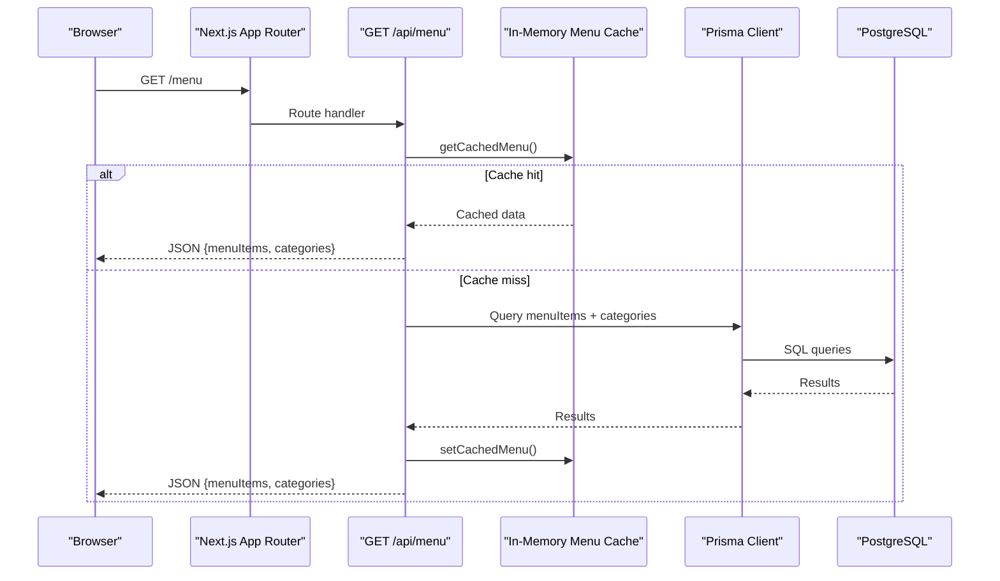
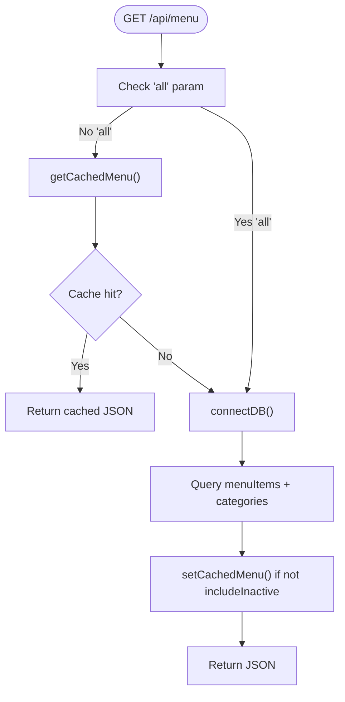
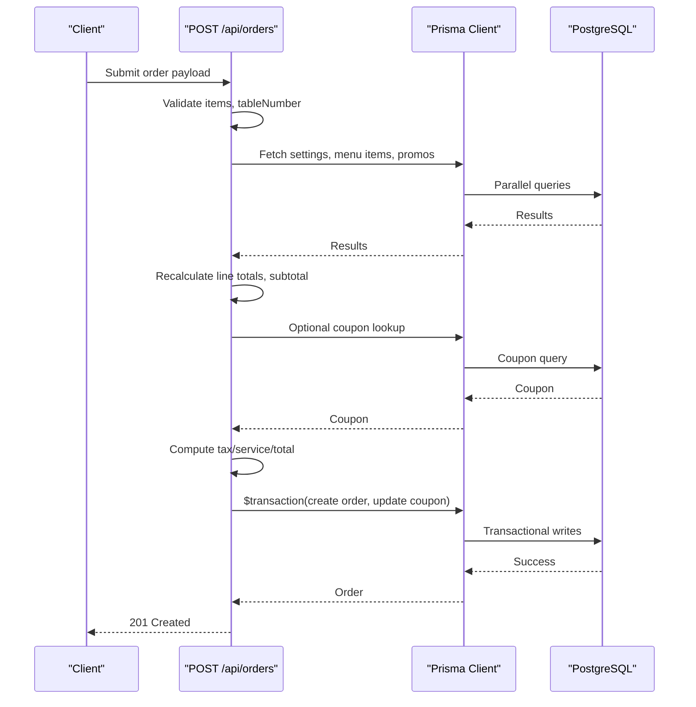
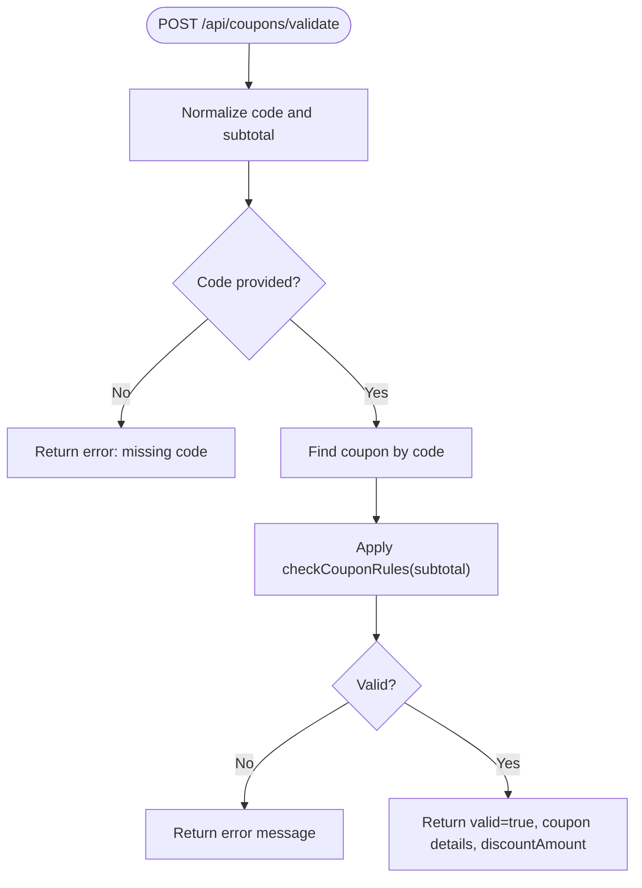
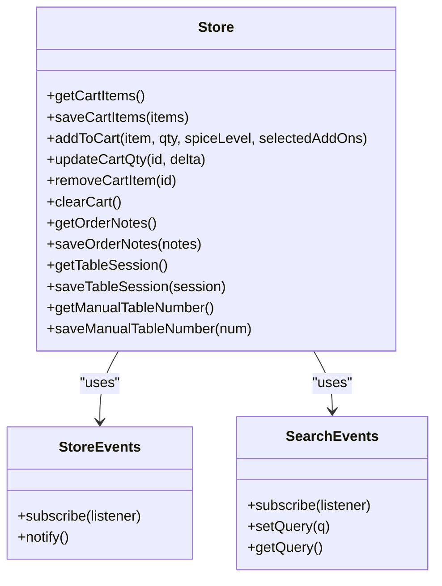
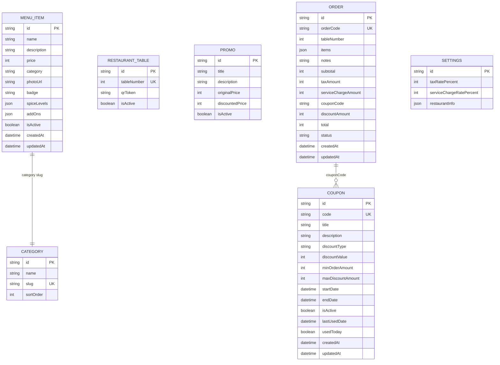
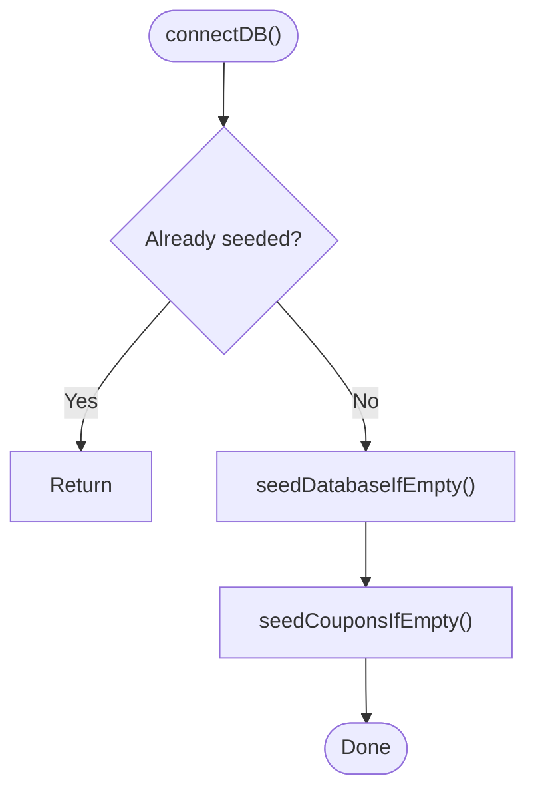
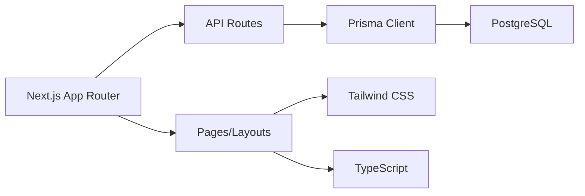

# Development Guide

<cite>
**Referenced Files in This Document**
- [README.md](file://README.md)
- [package.json](file://package.json)
- [next.config.js](file://next.config.js)
- [tailwind.config.ts](file://tailwind.config.ts)
- [tsconfig.json](file://tsconfig.json)
- [prisma/schema.prisma](file://prisma/schema.prisma)
- [app/layout.tsx](file://app/layout.tsx)
- [app/page.tsx](file://app/page.tsx)
- [components/ClientLayoutWrapper.tsx](file://components/ClientLayoutWrapper.tsx)
- [lib/db.ts](file://lib/db.ts)
- [lib/prisma.ts](file://lib/prisma.ts)
- [app/api/menu/route.ts](file://app/api/menu/route.ts)
- [app/api/orders/route.ts](file://app/api/orders/route.ts)
- [app/api/coupons/validate/route.ts](file://app/api/coupons/validate/route.ts)
- [lib/store.ts](file://lib/store.ts)
- [components/FloatingCart.tsx](file://components/FloatingCart.tsx)
- [components/Header.tsx](file://components/Header.tsx)
- [app/admin/layout.tsx](file://app/admin/layout.tsx)
</cite>

## Table of Contents
1. [Introduction](#introduction)
2. [Project Structure](#project-structure)
3. [Core Components](#core-components)
4. [Architecture Overview](#architecture-overview)
5. [Detailed Component Analysis](#detailed-component-analysis)
6. [Dependency Analysis](#dependency-analysis)
7. [Performance Considerations](#performance-considerations)
8. [Troubleshooting Guide](#troubleshooting-guide)
9. [Conclusion](#conclusion)
10. [Appendices](#appendices)

## Introduction
This guide explains how to contribute to Warkop Betawa, a Next.js 14 restaurant ordering application with a PostgreSQL backend via Prisma. It covers coding standards, TypeScript configuration, Tailwind CSS usage patterns, project structure conventions, and end-to-end workflows for adding features, creating API endpoints, implementing components, writing tests, debugging, profiling performance, and following Git branching and code review practices.

The app provides:
- Customer-facing menu browsing, cart, checkout, and order status
- Admin dashboard for managing menu items, categories, promos, orders, settings, tables, and coupons
- Server-side price recalculation and coupon validation for security
- In-memory caching for public menu reads

**Section sources**
- [README.md:1-105](file://README.md#L1-L105)

## Project Structure
Warkop Betawa follows the Next.js App Router layout with feature-based directories:
- app/: Pages, layouts, and API routes
- components/: Reusable UI components (client components where needed)
- lib/: Shared utilities, database access, types, and client state helpers
- prisma/: Database schema and migrations
- tailwind.config.ts: Design tokens and theme extensions
- tsconfig.json: TypeScript compiler options
- next.config.js: Next.js runtime configuration

**Diagram sources**
- [app/layout.tsx:1-24](file://app/layout.tsx#L1-L24)
- [components/ClientLayoutWrapper.tsx:1-45](file://components/ClientLayoutWrapper.tsx#L1-L45)
- [components/Header.tsx:1-121](file://components/Header.tsx#L1-L121)
- [components/FloatingCart.tsx:1-326](file://components/FloatingCart.tsx#L1-L326)
- [app/page.tsx:1-6](file://app/page.tsx#L1-L6)
- [app/api/menu/route.ts:1-109](file://app/api/menu/route.ts#L1-L109)
- [app/api/orders/route.ts:1-245](file://app/api/orders/route.ts#L1-L245)
- [app/api/coupons/validate/route.ts:1-58](file://app/api/coupons/validate/route.ts#L1-L58)
- [lib/prisma.ts:1-40](file://lib/prisma.ts#L1-L40)
- [lib/db.ts:1-161](file://lib/db.ts#L1-L161)
- [prisma/schema.prisma:1-107](file://prisma/schema.prisma#L1-L107)
- [tailwind.config.ts:1-45](file://tailwind.config.ts#L1-L45)
- [tsconfig.json:1-47](file://tsconfig.json#L1-L47)
- [next.config.js:1-15](file://next.config.js#L1-L15)

**Section sources**
- [app/layout.tsx:1-24](file://app/layout.tsx#L1-L24)
- [app/page.tsx:1-6](file://app/page.tsx#L1-L6)
- [tailwind.config.ts:1-45](file://tailwind.config.ts#L1-L45)
- [tsconfig.json:1-47](file://tsconfig.json#L1-L47)
- [next.config.js:1-15](file://next.config.js#L1-L15)

## Core Components
- Root layout and metadata: Defines site title, viewport, and global body classes using Tailwind design tokens.
- Client layout wrapper: Orchestrates Header, Footer, AI chat panel, FloatingCart, and ErrorBoundary; hides public chrome on admin routes.
- Header: Displays brand, search input, navigation links, AI assistant toggle, and cart badge; subscribes to store events for reactive updates.
- FloatingCart: Manages cart UI, quantity changes, removal animations, table number display, and checkout navigation; integrates with store events.
- Store: Provides cart persistence in localStorage, event emitters for reactive UI, and helpers for table session and notes.

Key responsibilities:
- Separation of server-rendered layout from client-side interactivity
- Centralized cart state with minimal re-renders via event-driven updates
- Consistent styling through Tailwind theme extensions

**Section sources**
- [app/layout.tsx:1-24](file://app/layout.tsx#L1-L24)
- [components/ClientLayoutWrapper.tsx:1-45](file://components/ClientLayoutWrapper.tsx#L1-L45)
- [components/Header.tsx:1-121](file://components/Header.tsx#L1-L121)
- [components/FloatingCart.tsx:1-326](file://components/FloatingCart.tsx#L1-L326)
- [lib/store.ts:1-217](file://lib/store.ts#L1-L217)

## Architecture Overview
The system uses Next.js App Router for both pages and API routes. Data is accessed via Prisma against PostgreSQL. Public menu reads are cached in memory to reduce DB load. Checkout enforces server-side price recalculation and coupon validation to prevent tampering.

**Diagram sources**
- [app/api/menu/route.ts:1-109](file://app/api/menu/route.ts#L1-L109)
- [lib/prisma.ts:1-40](file://lib/prisma.ts#L1-L40)

**Section sources**
- [app/api/menu/route.ts:1-109](file://app/api/menu/route.ts#L1-L109)
- [lib/prisma.ts:1-40](file://lib/prisma.ts#L1-L40)

## Detailed Component Analysis

### API Endpoints

#### GET /api/menu
- Purpose: List active menu items and all categories.
- Behavior:
  - Serves from in-memory cache when not requesting inactive items.
  - Falls back to Prisma queries otherwise.
  - Sets cache headers and invalidates cache on mutations.
- Validation: Minimal query param handling for including inactive items.

**Diagram sources**
- [app/api/menu/route.ts:1-109](file://app/api/menu/route.ts#L1-L109)

**Section sources**
- [app/api/menu/route.ts:1-109](file://app/api/menu/route.ts#L1-L109)

#### POST /api/orders
- Purpose: Create an order from customer checkout.
- Security: All monetary values are recalculated server-side; browser-supplied totals are ignored.
- Flow:
  - Validates items array and tableNumber.
  - Batch-fetches settings, menu items, and promos.
  - Validates add-ons against DB prices.
  - Validates optional coupon rules and applies discount.
  - Computes tax, service charge, and total.
  - Generates unique order code.
  - Executes transaction to atomically create order and update coupon usage.

**Diagram sources**
- [app/api/orders/route.ts:1-245](file://app/api/orders/route.ts#L1-L245)
- [lib/prisma.ts:1-40](file://lib/prisma.ts#L1-L40)

**Section sources**
- [app/api/orders/route.ts:1-245](file://app/api/orders/route.ts#L1-L245)

#### POST /api/coupons/validate
- Purpose: Validate a coupon code against current cart subtotal.
- Behavior:
  - Normalizes inputs and validates presence.
  - Looks up coupon by code.
  - Applies business rules and returns discount amount or error.

**Diagram sources**
- [app/api/coupons/validate/route.ts:1-58](file://app/api/coupons/validate/route.ts#L1-L58)

**Section sources**
- [app/api/coupons/validate/route.ts:1-58](file://app/api/coupons/validate/route.ts#L1-L58)

### Client State and UI Components

#### Store (lib/store.ts)
- Responsibilities:
  - Persist cart items, order notes, manual table number, and table session in localStorage.
  - Provide event emitter for reactive updates across components.
  - Sanitize and validate stored data to avoid runtime errors.
- Complexity:
  - Operations are O(n) over cart items for updates and removals.
  - Event notifications trigger lightweight re-renders in subscribed components.

**Diagram sources**
- [lib/store.ts:1-217](file://lib/store.ts#L1-L217)

**Section sources**
- [lib/store.ts:1-217](file://lib/store.ts#L1-L217)

#### FloatingCart
- Responsibilities:
  - Display cart items, quantities, and totals.
  - Handle quantity changes and item removal with animation.
  - Show table number badge and navigate to checkout.
- Integration:
  - Subscribes to store events for live updates.
  - Uses formatRupiah for currency formatting.

**Section sources**
- [components/FloatingCart.tsx:1-326](file://components/FloatingCart.tsx#L1-L326)
- [lib/store.ts:1-217](file://lib/store.ts#L1-L217)

#### Header
- Responsibilities:
  - Render brand, search input, navigation links, AI assistant toggle, and cart badge.
  - Subscribe to store and search events for reactive UI.
- Styling:
  - Uses Tailwind utility classes and brand colors defined in theme.

**Section sources**
- [components/Header.tsx:1-121](file://components/Header.tsx#L1-L121)

### Database and Seeding

#### Prisma Schema
- Entities: Category, MenuItem, RestaurantTable, Promo, Order, Coupon, Settings.
- Notes:
  - MenuItem.category is a string slug to align with existing UI filtering logic.
  - Settings acts as a singleton for tax and service charge rates.
  - Order uses human-readable codes like ARU-XXXX.

**Diagram sources**
- [prisma/schema.prisma:1-107](file://prisma/schema.prisma#L1-L107)

**Section sources**
- [prisma/schema.prisma:1-107](file://prisma/schema.prisma#L1-L107)

#### Database Utilities and Seeding
- connectDB(): Ensures DB seeding runs once per process lifetime.
- seedDatabaseIfEmpty(): Seeds categories, menu items, promos, settings, and tables 1–10.
- seedCouponsIfEmpty(): Seeds default coupons if none exist.

**Diagram sources**
- [lib/db.ts:1-161](file://lib/db.ts#L1-L161)

**Section sources**
- [lib/db.ts:1-161](file://lib/db.ts#L1-L161)

### Layouts and Routing
- Root layout sets metadata, viewport, and global body classes.
- ClientLayoutWrapper orchestrates public UI chrome and admin route exclusion.
- Admin layout provides its own layout without public header/footer/AI chat.

**Section sources**
- [app/layout.tsx:1-24](file://app/layout.tsx#L1-L24)
- [components/ClientLayoutWrapper.tsx:1-45](file://components/ClientLayoutWrapper.tsx#L1-L45)
- [app/admin/layout.tsx:1-12](file://app/admin/layout.tsx#L1-L12)

## Dependency Analysis
High-level dependencies:
- Next.js App Router serves pages and API routes.
- Prisma Client connects to PostgreSQL.
- Tailwind CSS compiles styles based on configured content paths and theme extensions.
- TypeScript ensures type safety across the codebase.

**Diagram sources**
- [package.json:1-42](file://package.json#L1-L42)
- [next.config.js:1-15](file://next.config.js#L1-L15)
- [tailwind.config.ts:1-45](file://tailwind.config.ts#L1-L45)
- [tsconfig.json:1-47](file://tsconfig.json#L1-L47)
- [lib/prisma.ts:1-40](file://lib/prisma.ts#L1-L40)

**Section sources**
- [package.json:1-42](file://package.json#L1-L42)
- [next.config.js:1-15](file://next.config.js#L1-L15)
- [tailwind.config.ts:1-45](file://tailwind.config.ts#L1-L45)
- [tsconfig.json:1-47](file://tsconfig.json#L1-L47)
- [lib/prisma.ts:1-40](file://lib/prisma.ts#L1-L40)

## Performance Considerations
- Menu read path:
  - Use in-memory cache for public menu reads to achieve <10ms responses.
  - Invalidate cache on menu mutations to ensure consistency.
- Database queries:
  - Batch fetch related data (settings, menu items, promos) in parallel.
  - Use Prisma query logging in development to monitor durations.
- Client rendering:
  - Minimize re-renders by subscribing to store events rather than polling.
  - Avoid heavy computations in render loops; compute totals outside render where possible.
- Images:
  - Configure remote image domains in Next.js config to enable optimized delivery.

[No sources needed since this section provides general guidance]

## Troubleshooting Guide
Common issues and resolutions:
- Database connection failures:
  - Verify DATABASE_URL and DIRECT_URL environment variables.
  - Ensure PostgreSQL is reachable and credentials are correct.
- Seeding not running:
  - Confirm connectDB() is called at the top of route handlers that mutate data.
  - Check logs for seed errors and retry behavior.
- Menu cache stale data:
  - Ensure invalidateMenuCache() is called after mutations.
  - Clear in-memory cache during development if necessary.
- Price discrepancies:
  - Confirm server-side recalculation in POST /api/orders is enforced.
  - Validate add-on prices against DB entries.
- Coupon validation errors:
  - Check coupon rules and date ranges.
  - Ensure coupon availability is re-checked inside transactions.

**Section sources**
- [lib/db.ts:1-161](file://lib/db.ts#L1-L161)
- [lib/prisma.ts:1-40](file://lib/prisma.ts#L1-L40)
- [app/api/menu/route.ts:1-109](file://app/api/menu/route.ts#L1-L109)
- [app/api/orders/route.ts:1-245](file://app/api/orders/route.ts#L1-L245)
- [app/api/coupons/validate/route.ts:1-58](file://app/api/coupons/validate/route.ts#L1-L58)

## Conclusion
Warkop Betawa combines Next.js App Router, Prisma, and Tailwind CSS to deliver a secure, performant restaurant ordering experience. The architecture emphasizes server-side validation, caching for read-heavy endpoints, and clean separation between server and client concerns. Following the guidelines in this document will help contributors maintain consistency, improve reliability, and scale the application effectively.

[No sources needed since this section summarizes without analyzing specific files]

## Appendices

### Coding Standards
- TypeScript:
  - Strict mode enabled; prefer explicit types and interfaces.
  - Use path aliases (@/*) for imports.
- React:
  - Use client components ('use client') only where interactivity is required.
  - Keep server components pure and data-focused.
- API routes:
  - Always validate and sanitize inputs.
  - Recalculate monetary values server-side.
  - Return consistent error shapes and HTTP status codes.
- Styling:
  - Prefer Tailwind utility classes; extend theme via tailwind.config.ts for brand tokens.
  - Avoid inline styles except for dynamic values.

**Section sources**
- [tsconfig.json:1-47](file://tsconfig.json#L1-L47)
- [tailwind.config.ts:1-45](file://tailwind.config.ts#L1-L45)
- [app/api/orders/route.ts:1-245](file://app/api/orders/route.ts#L1-L245)

### TypeScript Configuration
- Target ES2017 with DOM libs.
- Enable strict mode and isolated modules.
- Module resolution set to bundler for Next.js compatibility.
- Path alias @/* maps to repository root.

**Section sources**
- [tsconfig.json:1-47](file://tsconfig.json#L1-L47)

### Tailwind CSS Usage Patterns
- Content scanning includes pages, components, and app directories.
- Brand palette and typography extended in theme.
- Custom border radius and shadow utilities defined for consistent UI.

**Section sources**
- [tailwind.config.ts:1-45](file://tailwind.config.ts#L1-L45)

### Adding New Features
- Define new entities in prisma/schema.prisma and run migrations.
- Implement API routes under app/api/<feature>/route.ts with validation and error handling.
- Add client components under components/ and integrate via store events if stateful.
- Update Tailwind theme if introducing new design tokens.

**Section sources**
- [prisma/schema.prisma:1-107](file://prisma/schema.prisma#L1-L107)
- [app/api/menu/route.ts:1-109](file://app/api/menu/route.ts#L1-L109)
- [lib/store.ts:1-217](file://lib/store.ts#L1-L217)
- [tailwind.config.ts:1-45](file://tailwind.config.ts#L1-L45)

### Creating API Endpoints
- Follow the pattern in app/api/menu/route.ts for GET/POST handlers.
- Use connectDB() to ensure seeding before mutations.
- Return typed JSON responses and handle errors gracefully.

**Section sources**
- [app/api/menu/route.ts:1-109](file://app/api/menu/route.ts#L1-L109)
- [lib/db.ts:1-161](file://lib/db.ts#L1-L161)

### Implementing Components
- Use 'use client' for interactive components.
- Subscribe to store events for reactive updates.
- Keep UI logic separate from data fetching; use server components for data loading.

**Section sources**
- [components/Header.tsx:1-121](file://components/Header.tsx#L1-L121)
- [components/FloatingCart.tsx:1-326](file://components/FloatingCart.tsx#L1-L326)
- [lib/store.ts:1-217](file://lib/store.ts#L1-L217)

### Writing Tests
- Test API routes for validation, error handling, and business rules.
- Mock Prisma Client for database interactions.
- Test client components with event emulators and store mocks.

[No sources needed since this section provides general guidance]

### Debugging Techniques
- Enable Prisma query logging in development to inspect durations and queries.
- Use console logs in API routes for request/response tracing.
- Inspect localStorage for cart and session data in the browser.

**Section sources**
- [lib/prisma.ts:1-40](file://lib/prisma.ts#L1-L40)
- [lib/store.ts:1-217](file://lib/store.ts#L1-L217)

### Performance Profiling
- Monitor Prisma query durations in development logs.
- Profile React component renders using browser dev tools.
- Evaluate network requests for API endpoints and cache effectiveness.

**Section sources**
- [lib/prisma.ts:1-40](file://lib/prisma.ts#L1-L40)
- [app/api/menu/route.ts:1-109](file://app/api/menu/route.ts#L1-L109)

### Development Workflow
- Local setup:
  - Install dependencies and configure .env.local with MongoDB URI (or PostgreSQL via Prisma).
  - Run dev server and verify auto-seeding.
- Branching strategy:
  - Feature branches named feature/<short-description>.
  - Pull requests with clear descriptions and linked issues.
- Code review:
  - Ensure lint passes and tests cover critical paths.
  - Review for security (input validation, server-side calculations).
  - Confirm adherence to coding standards and Tailwind usage.

**Section sources**
- [README.md:1-105](file://README.md#L1-L105)
- [package.json:1-42](file://package.json#L1-L42)