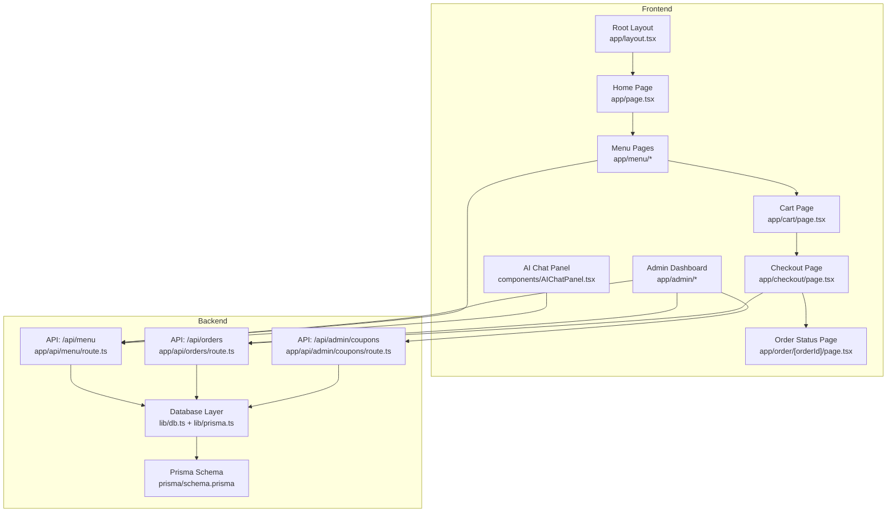
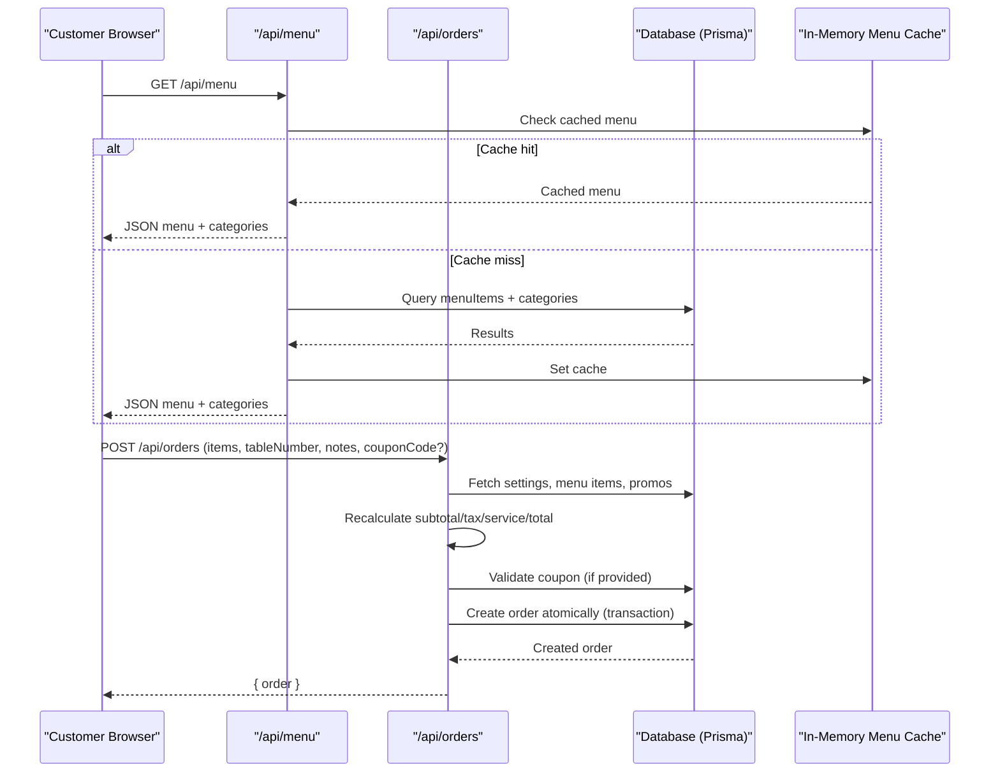
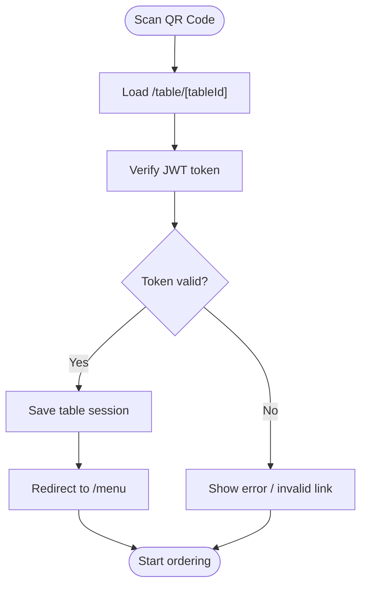
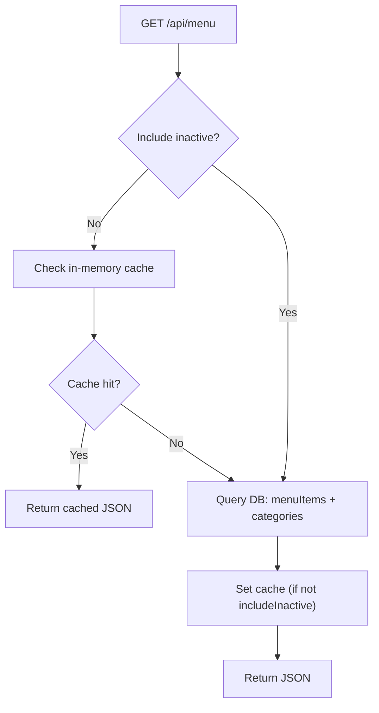
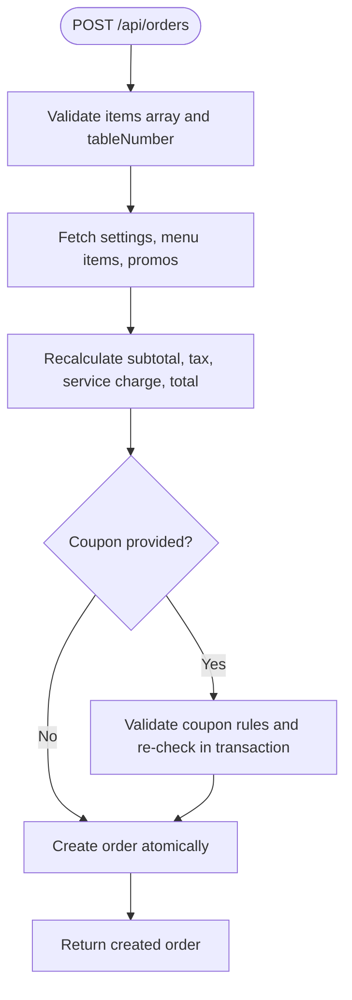
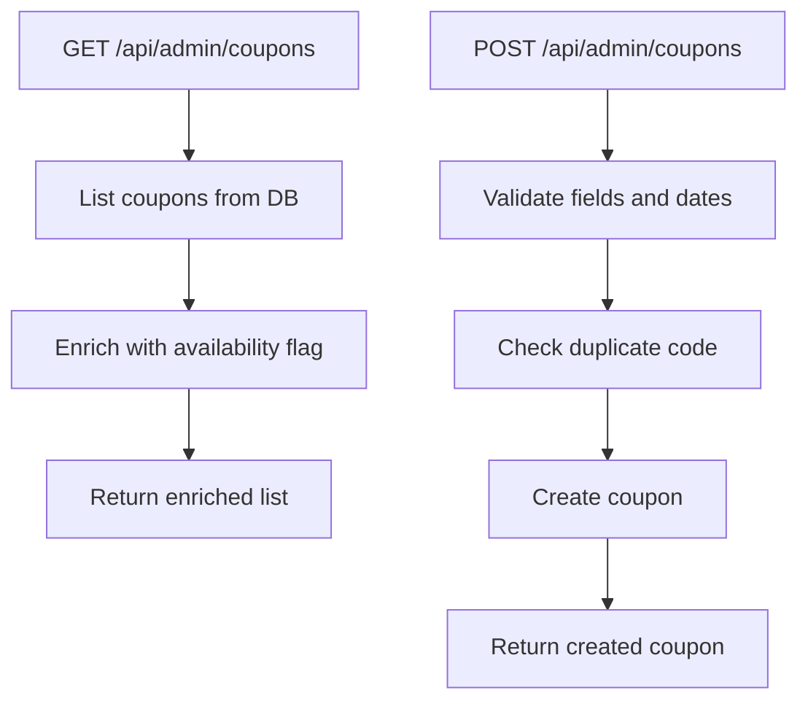
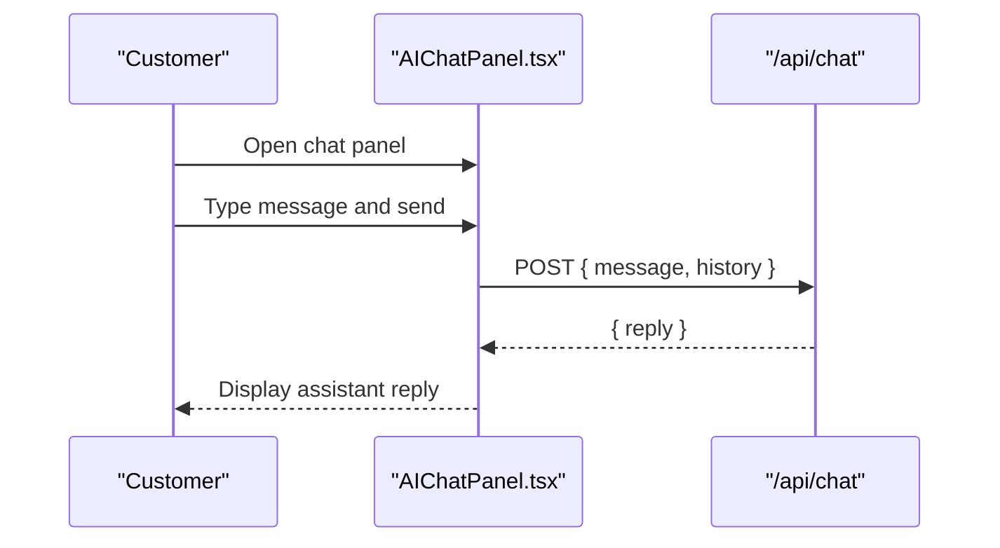
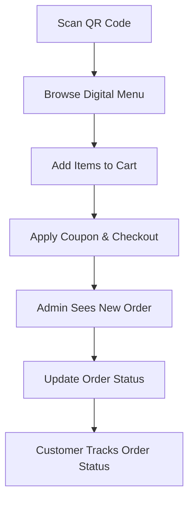
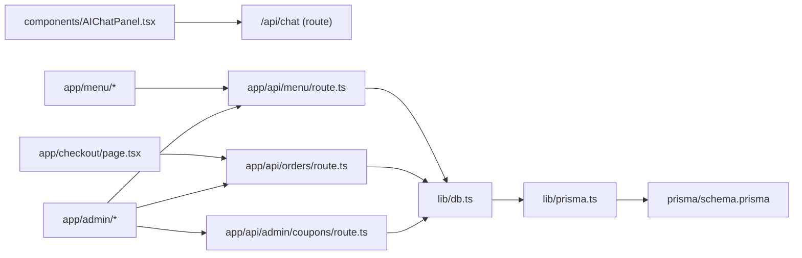

# Project Overview

<cite>
**Referenced Files in This Document**
- [README.md](file://README.md)
- [package.json](file://package.json)
- [next.config.js](file://next.config.js)
- [app/layout.tsx](file://app/layout.tsx)
- [app/page.tsx](file://app/page.tsx)
- [lib/db.ts](file://lib/db.ts)
- [lib/prisma.ts](file://lib/prisma.ts)
- [prisma/schema.prisma](file://prisma/schema.prisma)
- [app/api/menu/route.ts](file://app/api/menu/route.ts)
- [app/api/orders/route.ts](file://app/api/orders/route.ts)
- [app/api/admin/coupons/route.ts](file://app/api/admin/coupons/route.ts)
- [components/AIChatPanel.tsx](file://components/AIChatPanel.tsx)
- [lib/jwt.ts](file://lib/jwt.ts)
</cite>

## Table of Contents
1. [Introduction](#introduction)
2. [Project Structure](#project-structure)
3. [Core Components](#core-components)
4. [Architecture Overview](#architecture-overview)
5. [Detailed Component Analysis](#detailed-component-analysis)
6. [Dependency Analysis](#dependency-analysis)
7. [Performance Considerations](#performance-considerations)
8. [Troubleshooting Guide](#troubleshooting-guide)
9. [Conclusion](#conclusion)

## Introduction
Warkop Betawa is a Next.js 14 digital menu and order management system designed for restaurant dine-in ordering via QR codes. It provides:
- A customer-facing menu, cart, checkout, and live order status tracking
- An admin dashboard to manage menu items, categories, promos, coupons, tables, settings, and orders
- AI chat assistance integrated into the customer experience
- Real-time order updates through polling on the order status page

The system combines a Next.js frontend with a database layer managed by Prisma. The repository’s README describes it as a “Next.js 14 restaurant ordering app with a full MongoDB backend,” while the active Prisma schema and database initialization code target PostgreSQL (via Supabase). For deployment, you can switch between local and cloud databases using environment variables.

Key features:
- QR-based table ordering with signed tokens
- Live order status tracking with periodic polling
- Admin dashboard for full CRUD operations
- AI chat panel for menu recommendations and support
- Coupon validation and discount application at checkout

Technology stack:
- Next.js 14, React 18, TypeScript
- Prisma ORM
- Mongoose and Google Generative AI packages are present in dependencies
- Tailwind CSS for styling
- JWT for QR token generation/verification

System requirements:
- Node.js 18+
- A running database (local or cloud) configured via environment variables

Deployment options:
- Local development with a local database
- Production with a cloud database (e.g., MongoDB Atlas per README; PostgreSQL via Prisma configuration)

**Section sources**
- [README.md:1-10](file://README.md#L1-L10)
- [README.md:24-49](file://README.md#L24-L49)
- [README.md:53-81](file://README.md#L53-L81)
- [README.md:85-105](file://README.md#L85-L105)
- [package.json:13-39](file://package.json#L13-L39)
- [next.config.js:1-14](file://next.config.js#L1-L14)

## Project Structure
The project follows the Next.js App Router structure:
- `app/` contains routes for pages and API endpoints
- `components/` holds reusable UI components including the AI chat panel
- `lib/` includes database utilities, Prisma client, caching, types, and helpers
- `prisma/` defines the data model used by Prisma

**Diagram sources**
- [app/layout.tsx:1-24](file://app/layout.tsx#L1-L24)
- [app/page.tsx:1-6](file://app/page.tsx#L1-L6)
- [components/AIChatPanel.tsx:1-237](file://components/AIChatPanel.tsx#L1-L237)
- [app/api/menu/route.ts:1-109](file://app/api/menu/route.ts#L1-L109)
- [app/api/orders/route.ts:1-245](file://app/api/orders/route.ts#L1-L245)
- [app/api/admin/coupons/route.ts:1-129](file://app/api/admin/coupons/route.ts#L1-L129)
- [lib/db.ts:1-161](file://lib/db.ts#L1-L161)
- [lib/prisma.ts:1-40](file://lib/prisma.ts#L1-L40)
- [prisma/schema.prisma:1-107](file://prisma/schema.prisma#L1-L107)

**Section sources**
- [app/layout.tsx:1-24](file://app/layout.tsx#L1-L24)
- [app/page.tsx:1-6](file://app/page.tsx#L1-L6)
- [components/AIChatPanel.tsx:1-237](file://components/AIChatPanel.tsx#L1-L237)
- [app/api/menu/route.ts:1-109](file://app/api/menu/route.ts#L1-L109)
- [app/api/orders/route.ts:1-245](file://app/api/orders/route.ts#L1-L245)
- [app/api/admin/coupons/route.ts:1-129](file://app/api/admin/coupons/route.ts#L1-L129)
- [lib/db.ts:1-161](file://lib/db.ts#L1-L161)
- [lib/prisma.ts:1-40](file://lib/prisma.ts#L1-L40)
- [prisma/schema.prisma:1-107](file://prisma/schema.prisma#L1-L107)

## Core Components
- Database utilities and seeding:
  - `lib/db.ts` provides connection and seeding logic, memory store fallback, and initial data population for categories, menu items, promos, settings, and tables.
- Prisma client singleton:
  - `lib/prisma.ts` ensures a single PrismaClient instance across hot reloads and logs queries in development.
- Data model:
  - `prisma/schema.prisma` defines entities such as Category, MenuItem, RestaurantTable, Promo, Order, Coupon, and Settings.
- API routes:
  - `/api/menu` serves menu items and categories with in-memory caching for fast responses.
  - `/api/orders` handles order creation with server-side price recalculation, coupon validation, and atomic transactions.
  - `/api/admin/coupons` manages coupon listing and creation with business rule validation.
- AI chat integration:
  - `components/AIChatPanel.tsx` renders a slide-over chat interface that calls `/api/chat`.

**Section sources**
- [lib/db.ts:1-161](file://lib/db.ts#L1-L161)
- [lib/prisma.ts:1-40](file://lib/prisma.ts#L1-L40)
- [prisma/schema.prisma:1-107](file://prisma/schema.prisma#L1-L107)
- [app/api/menu/route.ts:1-109](file://app/api/menu/route.ts#L1-L109)
- [app/api/orders/route.ts:1-245](file://app/api/orders/route.ts#L1-L245)
- [app/api/admin/coupons/route.ts:1-129](file://app/api/admin/coupons/route.ts#L1-L129)
- [components/AIChatPanel.tsx:1-237](file://components/AIChatPanel.tsx#L1-L237)

## Architecture Overview
The system uses Next.js App Router for both UI and API routes. Customer flows interact with menu and order APIs, while admin flows manage content and promotions. The database layer is abstracted via Prisma, with seeding ensuring initial data availability.

**Diagram sources**
- [app/api/menu/route.ts:1-109](file://app/api/menu/route.ts#L1-L109)
- [app/api/orders/route.ts:1-245](file://app/api/orders/route.ts#L1-L245)
- [lib/db.ts:1-161](file://lib/db.ts#L1-L161)
- [lib/prisma.ts:1-40](file://lib/prisma.ts#L1-L40)

## Detailed Component Analysis

### QR-Based Table Ordering Flow
QR scanning lands customers on a table-specific route, where a signed token identifies the table session. Tokens are generated and verified using JWT.

**Diagram sources**
- [lib/jwt.ts:1-28](file://lib/jwt.ts#L1-L28)
- [README.md:53-64](file://README.md#L53-L64)

**Section sources**
- [lib/jwt.ts:1-28](file://lib/jwt.ts#L1-L28)
- [README.md:53-64](file://README.md#L53-L64)

### Menu API with Caching
The menu endpoint serves active menu items and categories, prioritizing an in-memory cache for low-latency responses. When inactive items are requested (admin), it bypasses cache and queries the database directly.

**Diagram sources**
- [app/api/menu/route.ts:1-109](file://app/api/menu/route.ts#L1-L109)

**Section sources**
- [app/api/menu/route.ts:1-109](file://app/api/menu/route.ts#L1-L109)

### Order Creation and Price Recalculation
Order creation validates inputs, fetches referenced items and settings, recalculates all monetary values server-side, applies coupons safely within a transaction, and returns the created order.

**Diagram sources**
- [app/api/orders/route.ts:1-245](file://app/api/orders/route.ts#L1-L245)

**Section sources**
- [app/api/orders/route.ts:1-245](file://app/api/orders/route.ts#L1-L245)

### Admin Coupons Management
Admin endpoints list coupons with availability flags and create new coupons after validating business rules (dates, discount type/value ranges, uniqueness).

**Diagram sources**
- [app/api/admin/coupons/route.ts:1-129](file://app/api/admin/coupons/route.ts#L1-L129)

**Section sources**
- [app/api/admin/coupons/route.ts:1-129](file://app/api/admin/coupons/route.ts#L1-L129)

### AI Chat Integration
The AI chat panel renders a slide-over UI, maintains message history, and posts user messages to `/api/chat`, rendering assistant replies inline with simple markdown support.

**Diagram sources**
- [components/AIChatPanel.tsx:1-237](file://components/AIChatPanel.tsx#L1-L237)

**Section sources**
- [components/AIChatPanel.tsx:1-237](file://components/AIChatPanel.tsx#L1-L237)

### Conceptual Overview
For beginners, this system digitizes the traditional dine-in ordering process:
- Customers scan a QR code at their table to access the digital menu
- They add items to a cart, apply coupons, and submit orders
- Orders appear in the admin dashboard with real-time status updates
- Staff can manage menus, categories, promos, coupons, and settings
- AI chat assists customers with menu questions and recommendations

[No sources needed since this diagram shows conceptual workflow, not actual code structure]

## Dependency Analysis
The following diagram highlights key runtime dependencies among core modules:

**Diagram sources**
- [components/AIChatPanel.tsx:1-237](file://components/AIChatPanel.tsx#L1-L237)
- [app/api/menu/route.ts:1-109](file://app/api/menu/route.ts#L1-L109)
- [app/api/orders/route.ts:1-245](file://app/api/orders/route.ts#L1-L245)
- [app/api/admin/coupons/route.ts:1-129](file://app/api/admin/coupons/route.ts#L1-L129)
- [lib/db.ts:1-161](file://lib/db.ts#L1-L161)
- [lib/prisma.ts:1-40](file://lib/prisma.ts#L1-L40)
- [prisma/schema.prisma:1-107](file://prisma/schema.prisma#L1-L107)

**Section sources**
- [components/AIChatPanel.tsx:1-237](file://components/AIChatPanel.tsx#L1-L237)
- [app/api/menu/route.ts:1-109](file://app/api/menu/route.ts#L1-L109)
- [app/api/orders/route.ts:1-245](file://app/api/orders/route.ts#L1-L245)
- [app/api/admin/coupons/route.ts:1-129](file://app/api/admin/coupons/route.ts#L1-L129)
- [lib/db.ts:1-161](file://lib/db.ts#L1-L161)
- [lib/prisma.ts:1-40](file://lib/prisma.ts#L1-L40)
- [prisma/schema.prisma:1-107](file://prisma/schema.prisma#L1-L107)

## Performance Considerations
- In-memory menu caching reduces latency for public menu requests and minimizes database load.
- Batch fetching of settings, menu items, and promos during order creation improves throughput.
- Server-side recalculation of totals prevents client-side manipulation and ensures consistent pricing.
- Atomic transactions for order creation and coupon usage avoid race conditions and maintain data integrity.
- Development logging of Prisma queries helps identify slow queries during local testing.

[No sources needed since this section provides general guidance]

## Troubleshooting Guide
Common issues and mitigations:
- Database seeding failures:
  - The seeding function retries on failure and resets the seed tracker to allow subsequent attempts.
- Menu loading errors:
  - The menu API catches errors and returns a localized error response.
- Order creation errors:
  - Input validation returns clear error messages; server-side recalculation ensures safe pricing.
- Coupon validation errors:
  - Business rule checks return descriptive errors; duplicate code checks prevent conflicts.

Operational tips:
- Ensure environment variables are correctly set for the database connection.
- Use the admin dashboard to verify initial data has been seeded (categories, menu items, promos, settings, tables).
- Monitor development logs for Prisma query performance insights.

**Section sources**
- [lib/db.ts:32-50](file://lib/db.ts#L32-L50)
- [app/api/menu/route.ts:61-64](file://app/api/menu/route.ts#L61-L64)
- [app/api/orders/route.ts:237-243](file://app/api/orders/route.ts#L237-L243)
- [app/api/admin/coupons/route.ts:121-127](file://app/api/admin/coupons/route.ts#L121-L127)

## Conclusion
Warkop Betawa delivers a modern, secure, and scalable restaurant ordering system built with Next.js and Prisma. It supports QR-based table ordering, real-time order tracking, comprehensive admin controls, and AI-assisted customer interactions. With clear separation of concerns, robust input validation, server-side price recalculation, and atomic transactions, the system balances usability for restaurant staff with reliability and security for customer transactions. Deployment flexibility allows switching between local and cloud databases via environment configuration.

[No sources needed since this section summarizes without analyzing specific files]